***Перед тем как начать***: прошу обратить внимание на то, что данный раздел репозитория составлен максимально подробно, но, тем не менее, я лично мог что-то упустить или описать в неправильном ключе. Не стоит воспринимать все описанное здесь как исключительную истину. При этом хочу отметить, что в рамках данного задания фактически нет ничего сложно (ввиду того, что данное задание является упрощенным), необходимо лишь разобраться, как конфигурировать отдельные сети ViPNet, а также их взаимодействие. Внимательно читайте мои комментарии - в них я постарался отразить самое важное и на что действительно стоит обратить внимание. 

Happy Hacking! :yum: :heartpulse:

---
### Часть 1. Подготовка

Для начала создадим для каждой виртуальной машины свои папки, как показано ниже:

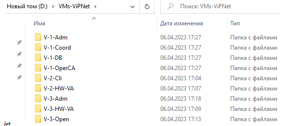

Далее необходимо создать и установить все виртуальные операционные системы в соответствии с таблицей ([[ViPNet-Labs/Lab-1/Reference]]):

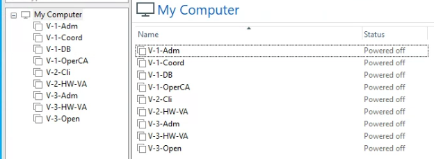

После этого необходимо настроить все сетевые интерфейсы на виртуальных машинах, а также выключить встроенный Firewall. Пример с ВМ **V-1-Adm**:

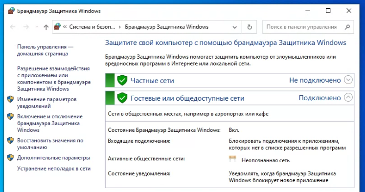

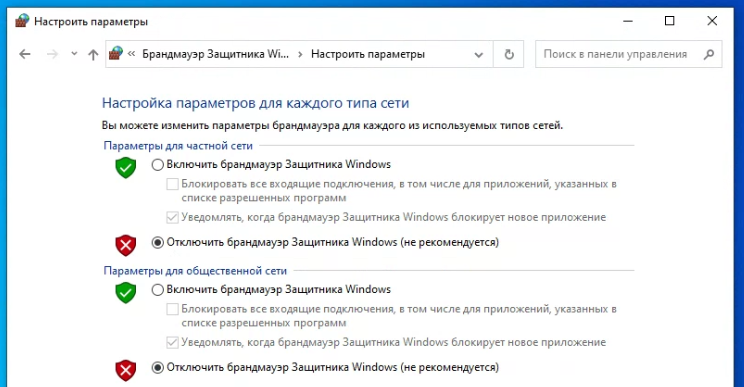

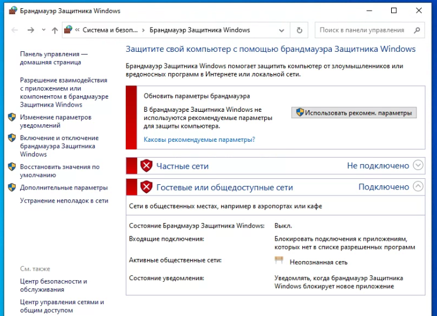

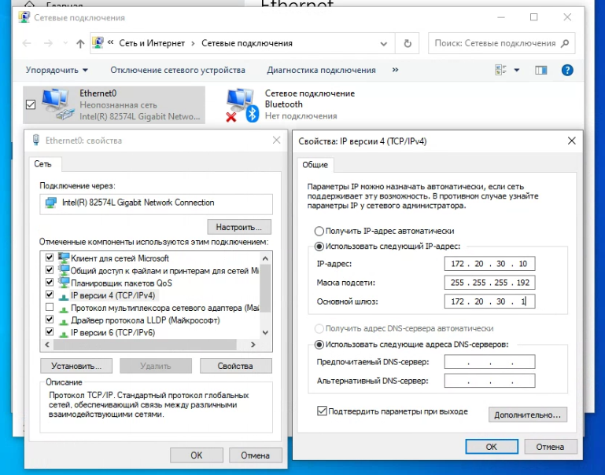

Обязательно нужно проверить установились ли параметры сети:

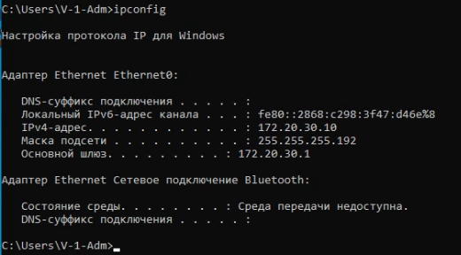

Таким же образом поступаем со всеми остальными машинами на базе Windows 10. После этого, необходимо проверить доступность хостов друг для друга в рамках своих подсетей, например:

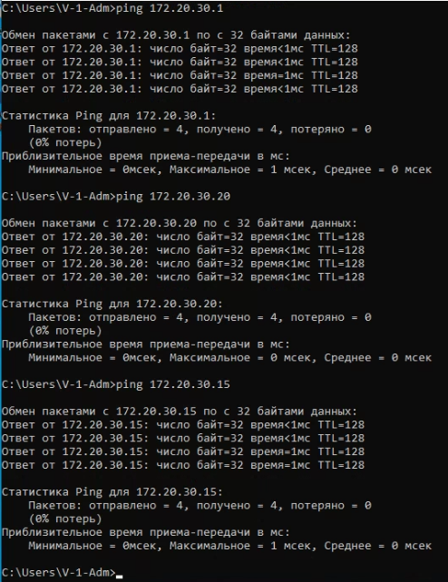

> Машины с идентификатором HW-VA не активны на данный момент, так как в них нет ключей, поэтому ping на них проверять не стоит. Реализация связности подсетей будет реализована позже.

Переходим на хост **V-1-DB** для того, чтобы установить SQL-сервер. Перед включением данной ВМ необходимо подключить к ней папку с компонентами ViPNet:

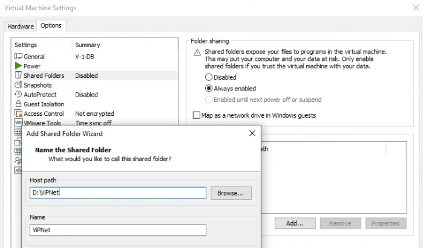

 > Для того, чтобы работала общая папка, на виртуальную машину необходимо установить пакет VMWare Tools. Вдобавок к этому, необходимо включить сетевое обнаружение.

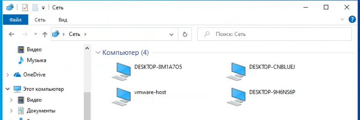

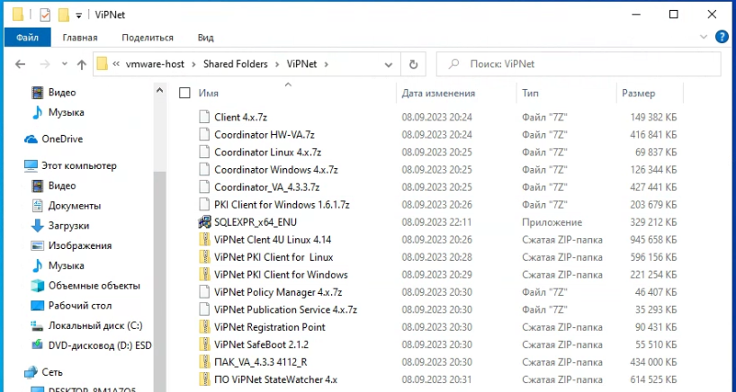

***Рефлексия части 1***:
- Созданы и установлены виртуальные машины в соответствии со схемой задания;
- Отключен компонент "Брандмауэр" на всех машинах с ОС Windows;
- Создана связность между подсетями;
- Для виртуальных машин установлен пакет VMWare Tools;
- Также реализована общая папка для ВМ и хостовой ОС для удобного обмена файлами между ВМ;

---
### Часть 2. Установка SQLExpress Server

Собственно, я заранее нашел установщик **SQLEXPRESS SERVER** и извлек его из архива (в моем случае он находился в ***ViPNet Administator/Soft/Центр управления сетью/Server Install/Packages/SqlExpress2014/SQLEXPR_x64_ENU.exe***). Копируем установщик себе на ВМ и начинаем установку:

1. Создаем папку **C:/SQLServer** и выбираем ее в качестве директории для установки компонентов:

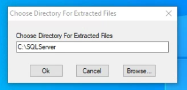

2. Выбираем "New SQL Server...":

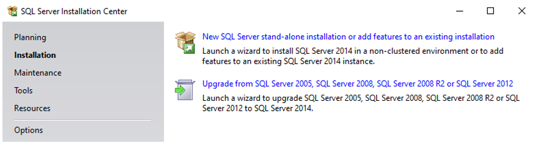

3. Принимаем лицензионное соглашение:

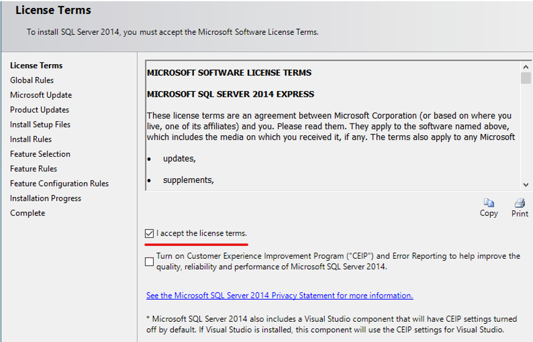

4. Пропускаем пункты "Microsoft Update" и "Product Updates"
5. Выбираем устанавливаемые компоненты:

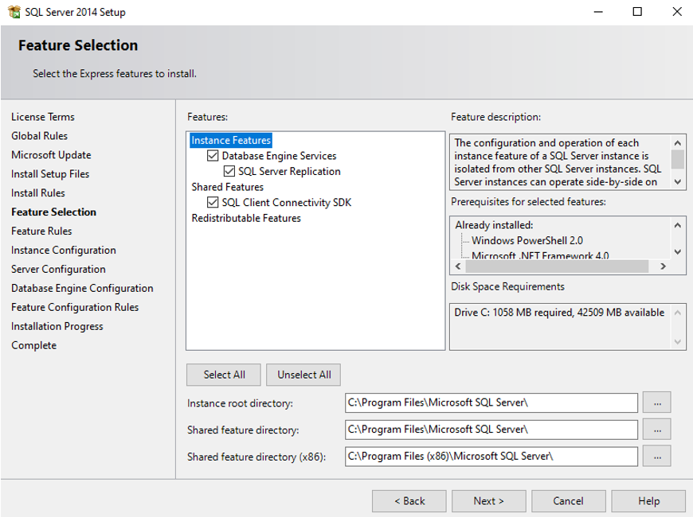

6. Конфигурирование состояния сервера:

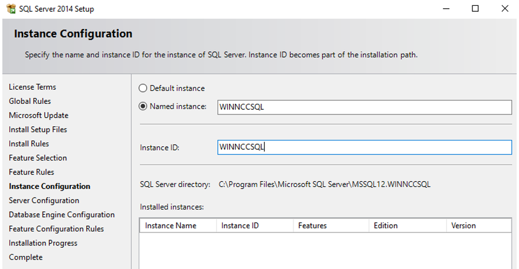

7. Конфигурация сервера:

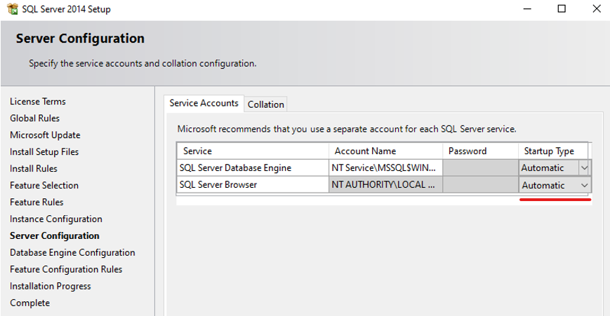

8. Конфигурация ядра БД (**пароль - 1234**):

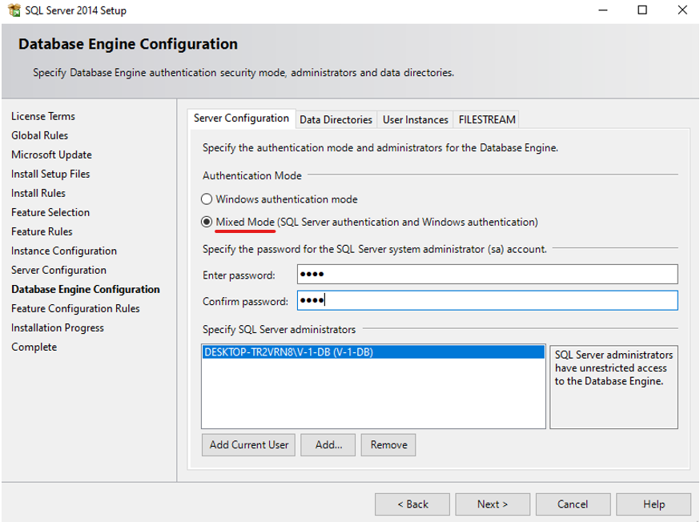

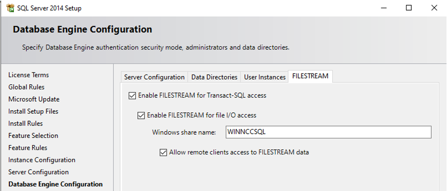

Далее происходит процесс установки. При успешном завершении инсталляции ошибок возникнуть не должно:

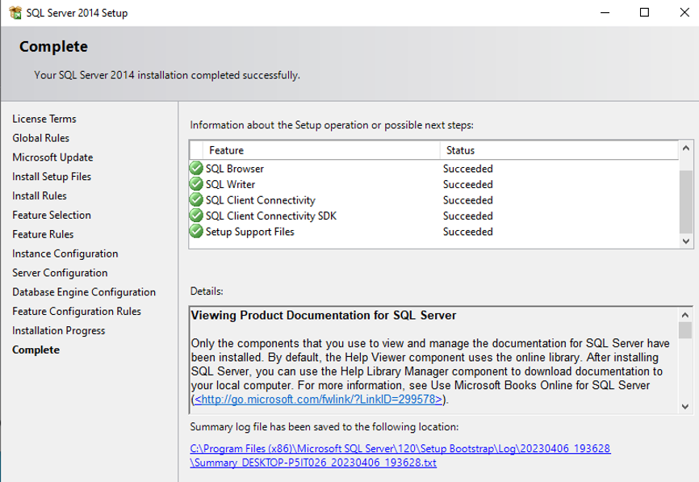

После успешной установки необходимо активировать **протокол TCP/IP** на SQL-сервере:

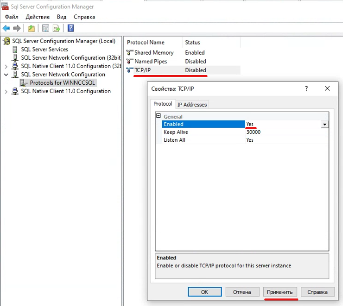

Перезапускаем SQL-сервер, чтобы изменения вступили в силу:

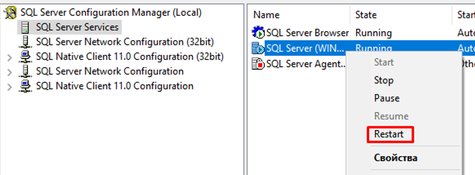

>  Точно такую же операцию необходимо повторить на хосте **V-3-Open**!

На этом установка и настройка SQLExpress-сервера завершена.

***Рефлексия части 2***:
- Произведены установка и конфигурирование SQLExpress Server 2014;
- Включен протокол TCP/IP на SQL-сервере.

---
### Часть 3. Установка ЦУС на Adm

#### 3.1. Установка серверной части ЦУС

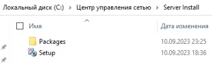

Подключаемся к базе данных, которую мы создали на прошлом этапе, но не путайте подсети - для каждой из них своя БД! Далее представлена установка ЦУС на ВМ V-1-Adm:

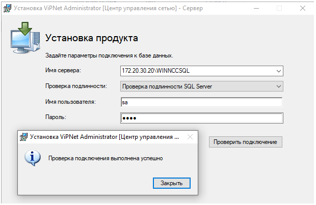

Обязательно стоит проверять подключение к БД, иначе далее продолжить настройку ViPNet будет невозможно.

> Логин: sa; Пароль: 1234

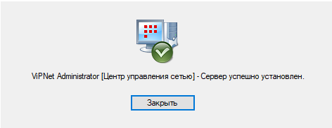

Тот же самый процесс проделываем для ВМ V-3-Adm, только не забываем поменять IP-адрес SQL-сервера.
#### 3.2. Установка клиентской части ЦУС

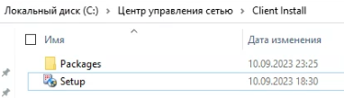

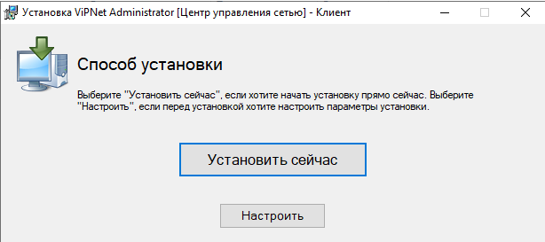

Дожидаемся процесса установки и приступаем к УКЦ

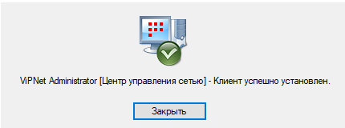

> Тот же самый процесс проделываем для ВМ V-3-Adm

---
### Часть 4. Установка УКЦ на Adm

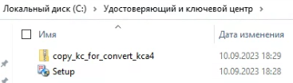

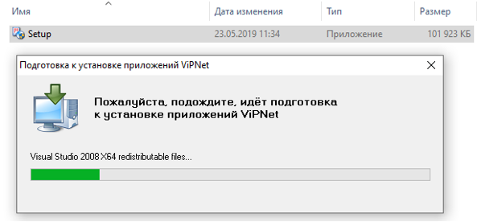

Точно также, как и с ЦУС, устанавливаем УКЦ, как для **V-1-Adm**, так и для **V-3-Adm**

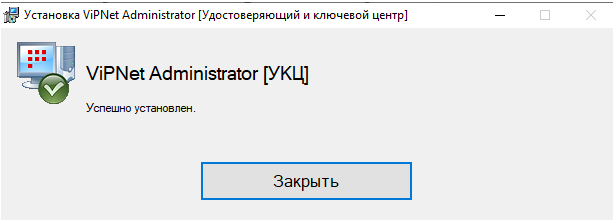

---
### Часть 5. Установка лицензии на ЦУС

Запускаем ЦУС на **V-1-Adm**. При первоначальной авторизации вводим **Administrator:Administrator**:

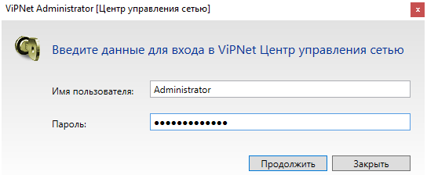

Далее нам сразу предлагают сменить пароль:

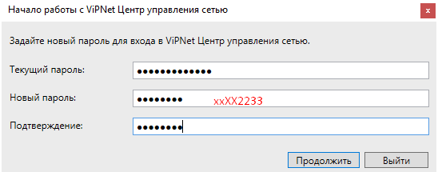

После этого необходимо установить лицензию:

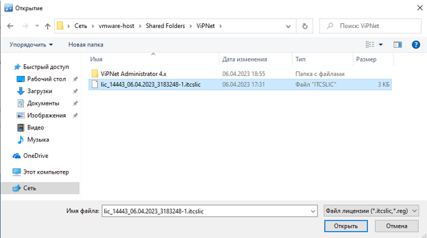

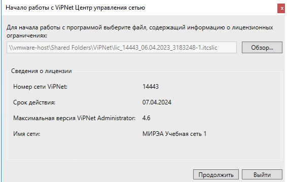

> Номер сети по первой лицензии - 14443

После принятия лицензии нам предлагается выбрать вариант начала работы. Это окно можно просто закрыть

Все операции необходимо повторить для V-3-Adm

> КРАЙНЕ ВАЖНО: обратите внимание на лицензии, их в нашем случае 2, ни в коем случае не применяйте одинаковые лицензии на несколько подсетей (ViPNet администраторов), иначе в дальнейшем невозможно будет настроить межсетевое взаимодействие между подсетями. Поэтому, на V-3-Adm активируем другую лицензию!

***Рефлексия части 3, 4 и 5***:
- Установка Центра управления сетью (ЦУС) - Серверная и клиентская части;
- Установка Удостоверяющего ключевого центра (УКЦ);
- Установка Лицензии при активации ЦУС.

---
### Часть 6. Создание координаторов и клиентов, присвоение связей и ролей

В ЦУС на **V-1-Adm** создаем два координатора - **Coordinator 1** и **Coordinator HW-VA**:

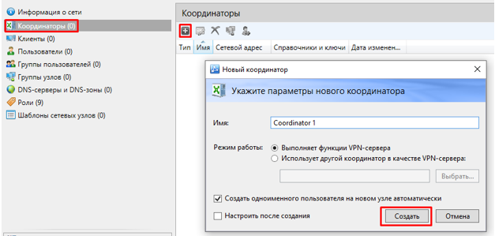

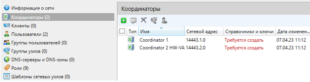

Далее создаем клиентов - **Admin 1**, **Client 2**, **OperCA**:

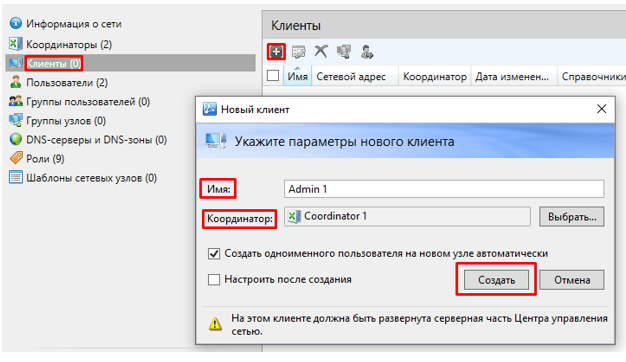

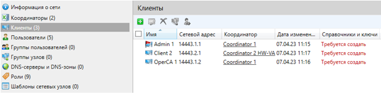

> Обратите внимание на то, каким пользователям, какие координаторы присвоены

По итогу имеем 5 пользователей (они создаются автоматически по мере создания клиентов и координаторов):

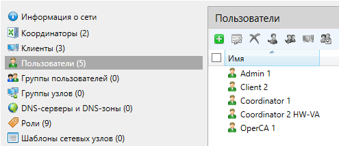

Далее создаем связи (все-ко-всем):

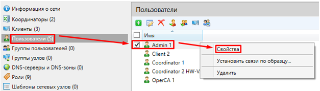

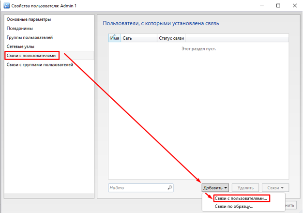

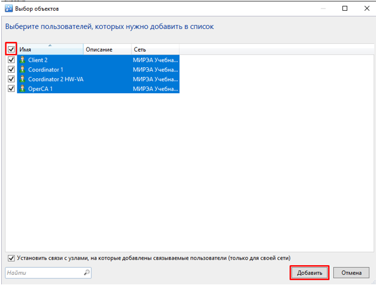

**Данный алгоритм нужно проделать для всех пользователей**. Выбор связей для каждого последующего пользователя будет сокращаться, поэтому у последнего из них вариантов не будет, т.к. все связи будут уже созданы.

Далее создаем межсерверный канал. Переходим на **Coordinator 1**:

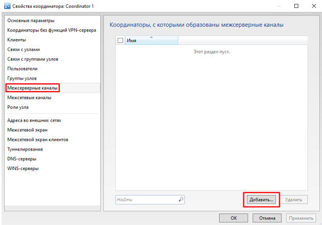

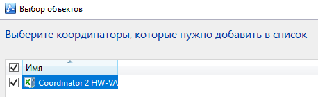

> Межсерверный канал создается только для подсетей, где расположены V-1-Coord и V-2-HW-VA, сеть V-3 это не касается!

***Рефлексия части 6***:
- Добавление в ЦУС координаторов и клиентов;
- Установка связей между клиентами (все-ко-всем);
- Создание межсерверного канала связи между двумя координаторами в рамках сети 14443.

---
### Часть 7. Создание ключей через УКЦ

Теперь в ЦУС выделяем все координаторы и создаем справочники (тоже самое делаем для "клиентов"):

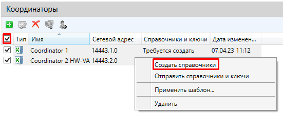

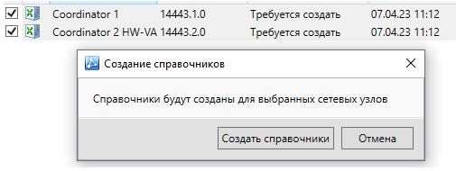

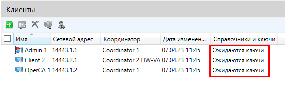

ЦУС указывает на то, что ожидаются ключи, поэтому запускаем УКЦ (**V-1-Adm**):

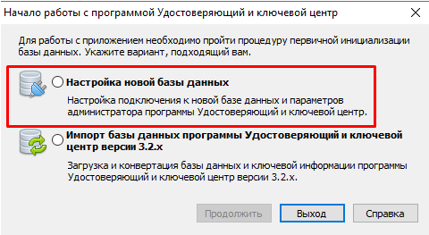

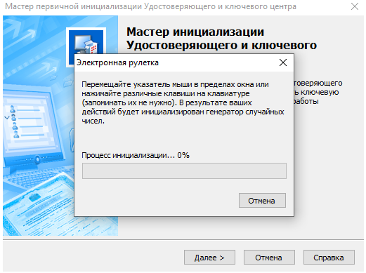

Производим первичную инициализацию:


> Имя и пароль не меняем


Далее следуют "**Сведения о владельце сертификата**", которые можно пропустить


Параметры ключа ЭЦП не изменяем


Разделы "**Сведения о точках распространения**" и "**Программные средства**" пропускаем, не меняя параметров


Завершение первичной инициализации УКЦ:


Далее создадим дистрибутив ключей:


Переходим в раздел "**Сетевые узлы**" и запускаем выдачу дистрибутива ключей:


Шифрование не меняем


Раздел "**Назначение сертификата**" пропускаем. Создаем пароль для пользователя **Admin 1** (т.к. он самый первый на выдаче):


"**Сведения о владельце сертификата**" пропускаем. Данные шаги необходимо проделать и для остальных пользователей. В случае, если вы выделили всех пользователей сразу, то процесс настройки не будет прерываться - вы сразу настраиваете всех пользователей.

> В случае, если дистрибутив ключей вы сделали неправильно по какой-либо причине, то стоит снова создать справочники в ЦУС, перейти после этого в УКЦ, выделить пользователей и "Выдать новый дистрибутив ключей"

Когда ключи будут сформированы, откроется директория с папками, где находятся ключи:


Для удобства перемещаем ключи в общую папку, которую мы подключали к ВМ. Далее эти ключи будут применены на соответствующих ВМ.

***Рефлексия части 7***:
- Создание справочников в ЦУС относительно координаторов и клиентов;
- Первичная инициализация УКЦ;
- Создание нового дистрибутива ключей;
- Копирование ключей в общую папку.

---
### Часть 8. Применение ключей на хостах

На машину **V-1-Cord** необходимо установить ПО координатора (Архив Coordinator for Windows):


После установки заходим в саму программу:


При первом запуске должен появиться запрос ключа. Устанавливаем его:


> Именно для этого мы переносили в общую папку ключи, чтобы удобно их вытащить при необходимости

Проходим авторизацию при запуске ПО ViPNet Coordinator:


После аутентификации приложение открывается в фоновом режиме, открываем его. Возможно, нужно немного подождать, пока у нас не спросят разрешения на работу с сетью:


Далее нам необходимо установить ПО **ViPNet Client** на **V-1-OperCA**, **V-1-Adm** и **V-2-Cli**. Сама установка не требует специфических операций - нужно просто запустить установщик. После этого запускаем установленное ПО на виртуальных машинах и применяем созданные ранее ключи. Итог:

V-1-Adm:


V-1-Coord:


V-2-Cli:


> Можно заметить, что, например, V-2-Cli не видит другие узлы сети. Это объясняется на данный момент тем, что наши два координатора Coordinator 1 и Coordinator 2 HW-VA не соединены между собой. С другой стороны, все хосты, которые относятся непосредственно к Coordinator 1 видят друг друга, как и должно быть

***Рефлексия части 8***:
-

---
### Часть 9. Настройка связности координаторов

Для начала необходимо координатору "**Coordiantor 2 HW-VA**" выдать роль "**Coordiantor HW-VA**" и удалить остальные роли. Данные операции проделываются через ЦУС на V-1-Adm:


Далее вновь для координаторов и клиентов создаем справочники (ЦУС):


Теперь в УКЦ выдаем новый дистрибутив ключей и передаем их в ЦУС (процесс выдачи нового дистрибутива ключей представлен выше):


Далее уже через ЦУС отправляем справочники и ключи:


После этого занимаемся установкой ключа на **Coordiantor 2 HW-VA**. Для этого нам необходима утилита, которая способна создавать iso-образы. Я использую **ImgBurn**. При помощи данной утилиты необходимо конечную папку с ключом от **Coordiantor 2 HW-VA** переделать в iso-образ, который впоследствии мы будем монтировать к виртуальной машине:


Подключаем диск к ВМ **V-2-HW-VA**:


Запускаем второй координатор и приступаем к его настройке:


> Первоначально, логин и пароль - user, после установки ключа данные для входа изменяется на - user:xxXX2233


Далее следует проверка пароля - xxXX2233 - после чего настраиваем сетевые интерфейсы:


Службы DNS и NTP в данный момент не настраиваем. Диапазон виртуальных IP-адресов оставляем по умолчанию. После этого нам предлагают проверить связь между координаторами:

Выбираем "Yes" и далее выбираем значение параметра "firewall mode". Необходимо выбрать "**No External Firewall**":


Далее необходимо выбрать сетевой интерфейс, который будет установлен в качестве внешнего, т.е. смотреть в сторону другого координатора:


Вот и найденный соседний координатор (V-1-Coord):


В итоге мы должны получить сообщение "**VPN probing has succeeded**". Заканчиваем конфигурирование координатора:


Если перейти на машину V-1-Coord и посмотреть компоненты сети, то можем обнаружить, что у нас все хосты определились:


Перед тем, как соединять две сети между собой, посмотрим, что мы имеем на данный момент:
1. Установленный SQL-сервер на V-3-Open;
2. Установленные ЦУС и УКЦ на V-3-Adm;
3. Активация Лицензии в ЦУС на V-3-Adm;
4. Созданный координатор "**Coordiantor 3 HW-VA**", которому присвоена **роль** "**Coordinator HW-VA**" (+ удалены остальные) в ЦУС на V-3-Adm;
5. Созданный клиент "**Admin 3**" (при его создании указывается **Coordiantor 3 HW-VA**) в ЦУС на V-3-Adm (**НЕ СОЗДАЕМ КЛИЕНТА ДЛЯ МАШИНЫ V-3-Open**), также установлены связи **ВСЕ-КО-ВСЕМ**;
6. Созданы справочники и ключи, при этом инициализирован УКЦ на V-3-Adm;
7. Выдан новый дистрибутив ключей для каждого пользователя/координатора через УКЦ на V-3-Adm (появились папки с папками, где лежат ключи);
8. Установлено ПО ViPNet Client на V-3-Adm (+активация);
9. Активирован координатор "**Coordiantor 3 HW-VA**" (тут **не нужно проверять соединение** между этим координатором и другими из первой и второй подсетей, просто завершаем настройку, но в качестве **основного шлюза** указываем **IP-адрес Coordiantor 1**). Когда вошли на координатор, можно проверить через ping доступность координатора 10.12.14.17;
10. Повторно **создаем справочники** в ЦУС на **V-3-Adm**, затем через УКЦ **создаем и передаем ключи в ЦУС**, после этого уже в ЦУС **отправляем справочники и ключи**.

---
### Часть 10. Установка межсетевого взаимодействия

После того, как мы сконфигурировали две независимые сети (с номерами **14443** и **14445**) со своими отдельными администраторами, необходимо их соединить. Соединение производится посредством обмена информацией между администраторами разных сетей. 

Переходим в ЦУС на **V-1-Adm** в раздел "Доверенные сети" и выбираем "Установить взаимодействие...":


**V-1-Adm** у нас будет выступать в роли инициатора межсетевого взаимодействия:


Указываем информацию противоположной сети. В качестве координатора, через который будет проходить туннель, указываем **Coorduinator 1**:


Далее необходимо добавить **все** сетевые узлы и **всех** пользователей сети 14443:


Создание и сохранение межсетевой информации:


После завершения операции переходим в УКЦ (**V-1-Adm**) и для начала создаем и экспортируем мастер-ключ, который необходим для установления межсетевого взаимодействия:


> Пароль: xxXX2233

Вот мы получили файл с межсетевой информацией и мастер-ключ:


> Перенесите эти два компонента в общую папку - дальше эти файлы нужны будут на V-3-Adm

Переключаемся на **V-3-Adm** и переходим в ЦУС, чтобы загрузить межсетевую информацию от V-1-Adm:


Здесь необходимо выбрать шлюзовый координатор противоположной сети с номером 14443. В нашем случае, это **Coordinator 3 HW-VA**:


Межсетевая информация загружена, далее загружаем мастер-ключ через УКЦ на V-3-Adm:


Ключ загружен. Теперь надо решить вопрос с некоторыми предупреждениями, которые возникли после импорта данных. Сначала в разделе "Администрирование" обрабатываем сертификат:


Теперь в разделе "Ключевой центр" создаем и передаем ключи в ЦУС:


Как видим, нам этого не удалось сделать по причине ошибки межсетевого мастер-ключа, поэтому исправляем проблему:


После исправления проблем, снова создаем и передаем ключи в ЦУС:


Далее создаем новые связи с пользователями (между пользователя из сети 14443 и 14445) через ЦУС на **V-3-Adm**:


Не видим пользователей из доверенной сети, поэтому добавляем объекты (клиентов из доверенной сети):


Связи с **Admin 3**:


Связи с **Coordinator 3 HW-VA**:


Раз мы добавили связи в сети 14445, необходимо уведомить об этом сеть 14443, поэтому мы также создаем межсетевую информацию, но теперь уже через ЦУС **V-3-Adm**


Сохраняем межсетевую информацию в файл, чтобы затем перенести ее на V-1-Adm:


После сохранения создается файл **14445-14443.lzh**. Его переносим в общую папку. Далее переходим на V-1-Adm и загружаем межсетевую информацию:


Теперь в ЦУС (**V-1-Adm**) вновь создаем сетевую информацию:


Теперь связи между пользователями разных сетей подтверждены:


Далее создадим справочники и ключи ЦУС (**V-1-Adm**):


Если возникают ошибки, исправляем их, как было ранее


После решения всех проблем создаем справочники, а также отправляем справочники и ключи:


> Тут нужно быть внимательным: справочники и ключи надо создать и отправить на V-1-Adm и на V-3-Adm!

Теперь можно перейти в **ViPNet Client** на V-1-Adm и увидеть, что в нашей защищенной сети появились хосты из другой (отмечены как **VPN №14445**)


Тут может произойти такое, что в какую-то из сетей не дошла информация от другой. Это в какой-то степени нормально. Нормально в том случае, если другая сеть видит все клиенты первой (обратите внимание на скрины выше и ниже):


Обмен информацией между сетями прошел успешно. В случае, если информация по какой-то причине не дошла, то, во-первых, следует снова зайти в ЦУС -> Доверенные сети -> Отправить межсетевую информацию, на другой стороне (на втором админе -> Обработать межсетевую информацию). Также стоит проверить, нужно ли где-то снова создать справочники и ключи (затем через УКЦ передать их в ЦУС и через ЦУС отправить на хосты)

После завершения всех процедур имеем две соединенные сети:


---
### Часть 11.  Создание туннелированного соединения между V-1-DB и V-3-Open

В заключение нашего тестового практического применения комплекса ViPNet **создадим туннель между V-1-DB и V-3-Open**. Оба клиента находятся в разных подсетях. Да, они по факту соединены через координатор, но НЕТ! И вот почему (тут я могу быть не точен или вовсе не прав):
1. Координатор маршрутизирует трафик в рамках своей виртуальной сети, поэтому прямой ping между данными ВМ никак не будет прослеживаться;
2. На данных хостах вообще не установлено ПО ViPNet Client, поэтому они к ней и не относятся. Администраторы просто обращаются к своим хостам, вернее к их БД, для этого V-1-DB и V-3-Open не обязательно должны быть полноценными участниками сети ViPNet.

Сначала на V-1-Adm через ЦУС в свойствах координатора **Coordinator 1** в разделе "Туннелирование" увеличиваем максимальное число одновременно туннелируемых соединений до 2, а также добавляем новое туннелированное соединение:


Указываем IP-адрес противоположного хоста (V-3-Open):


Далее создаем справочники:


Далее на V-3-Adm также создаем туннелируемое соединение, не забывая увеличить число туннелируемых соединений:


Далее на обоих администраторах обмениваемся и принимаем межсетевую информацию:

**V-1-Adm**:


**V-3-Adm**:


Cнова создаем и отправляем справочники и ключи на V-1-Adm и V-3-Adm. На этом все. При правильной конфигурации туннеля ping между V-1-DB и V-3-Open должен появиться:


---
