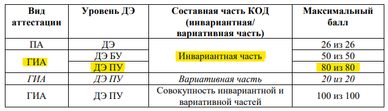
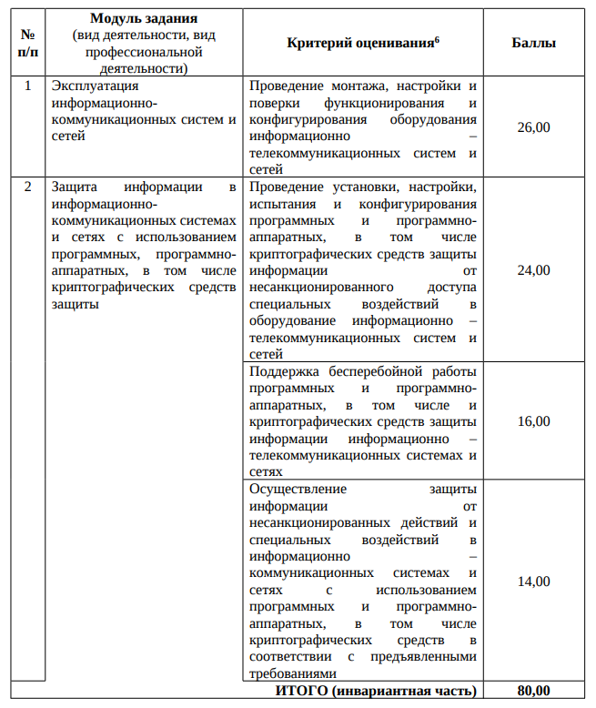
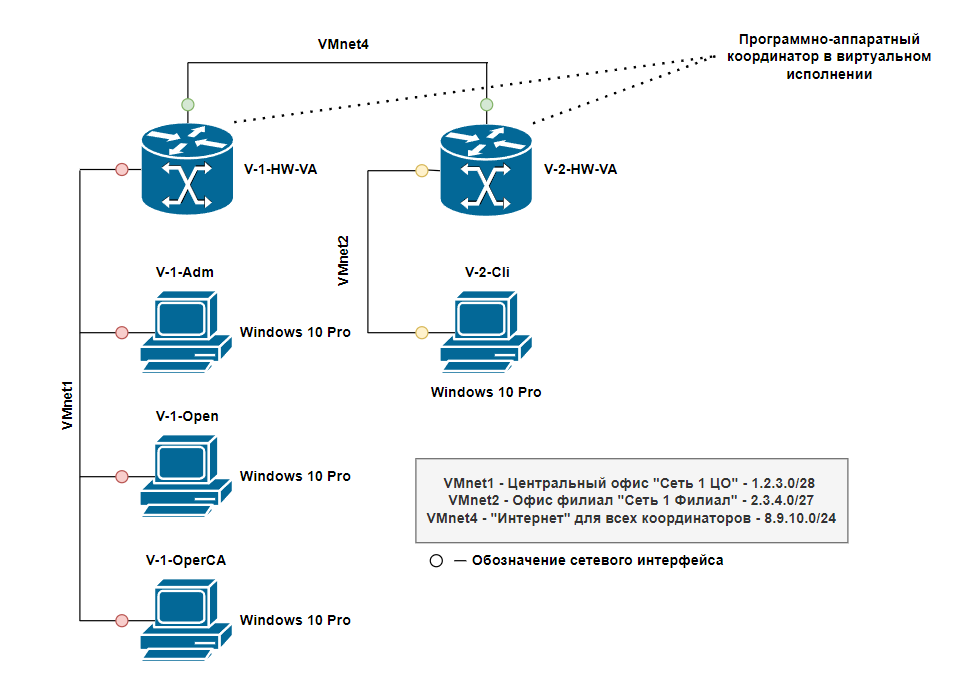
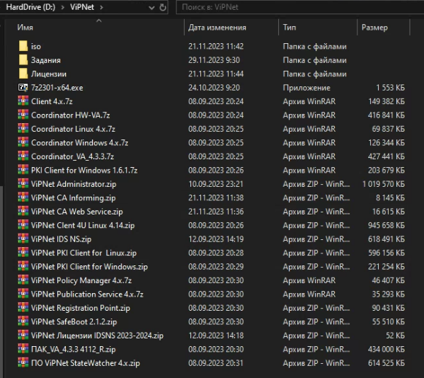

***Перед тем как начать***: прошу обратить внимание на то, что данный раздел репозитория составлен максимально подробно, но, тем не менее, я лично мог что-то упустить или описать в неправильном ключе. Не стоит воспринимать все описанное здесь в качестве исключительной истины. При этом хочу отметить, что в рамках данного задания фактически нет ничего сложно, необходимо лишь разобраться, как конфигурировать отдельные сети ViPNet, а также их взаимодействие. Внимательно читайте мои комментарии - в них я постарался отразить самое важное и на что действительно стоит обратить внимание. 

Авторы не несут ответственность за ваш несданный демонстрационный экзамен! 

Made with :heartpulse: by "**o1d_bu7_go1d**" for KPK Students

---
### Критерии оценивания

В таблицах ниже представлены критерии оценивания из официальных [оценочных материалов](https://bom.firpo.ru/file/9991/КОД%2010.02.04-1-2024%20Том%201.pdf)

> В рамках лабораторной работы реализуем инвариантную часть демонстрационного экзамена профессионального уровня - максимально допустимый балл - 80. Длительность - 3 часа 30 минут.

Критерии перевода баллов в оценки (для 100 баллов):
- 0,00 - 19,99 - оценка 2
- 20,00 - 39,99 - оценка 3
- 40,00 - 69,99 - оценка 4
- 70,00 - 100,00 - оценка 5

---
### Схема сети

---
### Таблица маршрутизации (не будет выдана на ДЭ)

| V-Подсеть-Имя | Версия ОС | Адаптер | IP-адрес     | Маска подсети         | Шлюз         |
| ------------- | --------- | ------- | ------------ | --------------------- | ------------ |
| V-1-HW-VA     | Linux     | VMnet1  | **1.2.3.1**  | 255.255.255.240 (/28) | -            |
|               |           | VMnet4  | **8.9.10.1** | 255.255.255.0 (/24)   | **8.9.10.2** |
| V-1-DB        | Win10 Pro | VMnet1  | 1.2.3.2      | 255.255.255.240 (/28) | **1.2.3.1**  |
| V-1-Adm       | Win10 Pro | VMnet1  | 1.2.3.3      | 255.255.255.240 (/28) | **1.2.3.1**  |
| V-1-OperCA    | Win10 Pro | VMnet1  | 1.2.3.4      | 255.255.255.240 (/28) | **1.2.3.1**  |
| V-2-HW-VA     | Linux     | VMnet2  | **2.3.4.1**  | 255.255.255.224 (/27) | -            |
|               |           | VMnet4  | 8.9.10.2     | 255.255.255.0 (/24)   | **8.9.10.1** |
| V-2-Cli       | Win10 Pro | VMnet2  | 2.3.4.2      | 255.255.255.224 (/27) | **2.3.4.1**  |

---
### Программное обеспечение + Логины/Пароли

Имеющийся перечень ПО (также имеется доп. ПО + лицензии):

Пароль от всех учетных данных на **Windows 10 Pro** - xxXX2244
Логин/Пароль от **Linux Coordinator HW-VA**  - user:user