***Перед тем как начать***: прошу обратить внимание на то, что данный раздел репозитория составлен максимально подробно, но, тем не менее, я лично мог что-то упустить или описать в неправильном ключе. Не стоит воспринимать все описанное здесь в качестве исключительной истины. При этом хочу отметить, что в рамках данного задания фактически нет ничего сложно, необходимо лишь разобраться, как конфигурировать отдельные сети ViPNet, а также их взаимодействие. Внимательно читайте мои комментарии - в них я постарался отразить самое важное и на что действительно стоит обратить внимание. 

Авторы не несут ответственность за ваш несданный демонстрационный экзамен! 

Made with :heartpulse: by "**o1d_bu7_go1d**" for KPK Students

---
### Оглавление

1. [Подготовка](https://github.com/Abends2/ViPNet__Labs/blob/main/ViPNet-Labs/Lab-2/ViPNet-Training-2-DemoExam-2024.md#подготовка)
    - [Часть 1. Добавление виртуальных машин в библиотеку VMWare Workstation](https://github.com/Abends2/ViPNet__Labs/blob/main/ViPNet-Labs/Lab-2/ViPNet-Training-2-DemoExam-2024.md#часть-1-добавление-виртуальных-машин-в-библиотеку-vmware-workstation)
    - [Часть 2. Расширение памяти](https://github.com/Abends2/ViPNet__Labs/blob/main/ViPNet-Labs/Lab-2/ViPNet-Training-2-DemoExam-2024.md#часть-2-расширение-памяти)
    - [Часть 3. Включение общей папки между ВМ и хостовой ОС](https://github.com/Abends2/ViPNet__Labs/blob/main/ViPNet-Labs/Lab-2/ViPNet-Training-2-DemoExam-2024.md#часть-3-включение-общей-папки-между-вм-и-хостовой-ос)
    - [Часть 4. Настройка IP-адресов](https://github.com/Abends2/ViPNet__Labs/blob/main/ViPNet-Labs/Lab-2/ViPNet-Training-2-DemoExam-2024.md#часть-4-настройка-ip-адресов)
    - [Часть 5. Отключение брандмауэра](https://github.com/Abends2/ViPNet__Labs/blob/main/ViPNet-Labs/Lab-2/ViPNet-Training-2-DemoExam-2024.md#часть-5-отключение-брандмауэра)
    - [Часть 6. Настройка спящего режима](https://github.com/Abends2/ViPNet__Labs/blob/main/ViPNet-Labs/Lab-2/ViPNet-Training-2-DemoExam-2024.md#часть-6-настройка-дисплея-и-спящего-режима)
    - [Часть 7. Активация режима частной сети](https://github.com/Abends2/ViPNet__Labs/edit/main/ViPNet-Labs/Lab-2/ViPNet-Training-2-DemoExam-2024.md#часть-7-активация-режима-частной-сети)
2. [Задание 1. Развертывание ПК Administrator в качестве центра сертификации](https://github.com/Abends2/ViPNet__Labs/blob/main/ViPNet-Labs/Lab-2/ViPNet-Training-2-DemoExam-2024.md#задание-1-развертывание-пк-administrator-в-качестве-центра-сертификации)
    - [Часть 1. Установка БД на V-1-DB](https://github.com/Abends2/ViPNet__Labs/blob/main/ViPNet-Labs/Lab-2/ViPNet-Training-2-DemoExam-2024.md#часть-1-установка-бд-на-v-1-db)
    - [Часть 2. Установка серверного приложения ЦУС и УКЦ на V-1-Adm, настройка службы NccService](https://github.com/Abends2/ViPNet__Labs/blob/main/ViPNet-Labs/Lab-2/ViPNet-Training-2-DemoExam-2024.md#часть-2-установка-серверного-приложения-цус-и-укц-на-v-1-adm-настройка-службы-nccservice)
    - [Часть 3. Установка клиентского приложения ЦУС на V-1-Adm](https://github.com/Abends2/ViPNet__Labs/blob/main/ViPNet-Labs/Lab-2/ViPNet-Training-2-DemoExam-2024.md#часть-3-установка-клиентского-приложения-цус-на-v-1-adm)
3. [Задание 2. Инициализация VPN Coordinator и установка ПО VPN Client](https://github.com/Abends2/ViPNet__Labs/blob/main/ViPNet-Labs/Lab-2/ViPNet-Training-2-DemoExam-2024.md#задание-2-инициализация-vpn-coordinator-и-установка-по-vpn-client)
4. [Задание 3. Инициализация VPN Coordinator и установка ПО VPN Client для организации сети филиала](https://github.com/Abends2/ViPNet__Labs/blob/main/ViPNet-Labs/Lab-2/ViPNet-Training-2-DemoExam-2024.md#задание-3-инициализация-vpn-coordinator-и-установка-по-vpn-client-для-организации-сети-филиала)
    - [Часть 1. Установка ViPNet Client](https://github.com/Abends2/ViPNet__Labs/blob/main/ViPNet-Labs/Lab-2/ViPNet-Training-2-DemoExam-2024.md#часть-1-установка-vipnet-client)
5. [Задание 4. Развертывание удостоверяющего и ключевого центра в составе сети](https://github.com/Abends2/ViPNet__Labs/blob/main/ViPNet-Labs/Lab-2/ViPNet-Training-2-DemoExam-2024.md#задание-4-развертывание-удостоверяющего-и-ключевого-центра-в-составе-сети)
6. [Задание 5. Создание структуры защищенной сети](https://github.com/Abends2/ViPNet__Labs/blob/main/ViPNet-Labs/Lab-2/ViPNet-Training-2-DemoExam-2024.md#задание-5-создание-структуры-защищенной-сети)
7. [Задание 6. Установка центра регистрации, сервиса публикации и сервиса информирования Certification Authority на соответствующие виртуальные машины](https://github.com/Abends2/ViPNet__Labs/blob/main/ViPNet-Labs/Lab-2/ViPNet-Training-2-DemoExam-2024.md#задание-6-установка-центра-регистрации-сервиса-публикации-и-сервиса-информирования-certification-authority-на-соответствующие-виртуальные-машины)
    - [Часть 1. Создание структуры защищенной сети](https://github.com/Abends2/ViPNet__Labs/blob/main/ViPNet-Labs/Lab-2/ViPNet-Training-2-DemoExam-2024.md#часть-1-создание-структуры-защищенной-сети)
         - [1.1. Создание координаторов и их пользователей](https://github.com/Abends2/ViPNet__Labs/blob/main/ViPNet-Labs/Lab-2/ViPNet-Training-2-DemoExam-2024.md#11-создание-координаторов-и-их-пользователей)
         - [1.2. Создание клиентов и их пользователей](https://github.com/Abends2/ViPNet__Labs/blob/main/ViPNet-Labs/Lab-2/ViPNet-Training-2-DemoExam-2024.md#12-создание-клиентов-и-их-пользователей)
    - [Часть 2. Создание связей между пользователями, присвоение ролей узлам сети, создание межсерверного канала, выгрузка отчета в формате HTML](https://github.com/Abends2/ViPNet__Labs/blob/main/ViPNet-Labs/Lab-2/ViPNet-Training-2-DemoExam-2024.md#часть-2-создание-связей-между-пользователями-присвоение-ролей-узлам-сети-создание-межсерверного-канала-выгрузка-отчета-в-формате-html)
         - [2.1. Присвоение ролей узлам сети, создание межсерверного канала](https://github.com/Abends2/ViPNet__Labs/blob/main/ViPNet-Labs/Lab-2/ViPNet-Training-2-DemoExam-2024.md#21-присвоение-ролей-узлам-сети-создание-межсерверного-канала)
         - [2.2. Связи между пользователями](https://github.com/Abends2/ViPNet__Labs/blob/main/ViPNet-Labs/Lab-2/ViPNet-Training-2-DemoExam-2024.md#22-связи-между-пользователями)
         - [2.3. Установка IP-адресов через ЦУС для клиентов и координаторов](https://github.com/Abends2/ViPNet__Labs/blob/main/ViPNet-Labs/Lab-2/ViPNet-Training-2-DemoExam-2024.md#23-установка-ip-адресов-через-цус-для-клиентов-и-координаторов)
         - [2.4. Выгрузка отчета в формате HTML](https://github.com/Abends2/ViPNet__Labs/blob/main/ViPNet-Labs/Lab-2/ViPNet-Training-2-DemoExam-2024.md#24-выгрузка-отчета-в-формате-html)
         - [2.5. Заканчиваем \(забежим немного вперед\)](https://github.com/Abends2/ViPNet__Labs/blob/main/ViPNet-Labs/Lab-2/ViPNet-Training-2-DemoExam-2024.md#25-заканчиваем-забежим-немного-вперед)
    - [Часть 3. Создание дистрибутива ключей для узлов сети средствами УКЦ, распространение DST-ключей, инициализация координаторов, проверка работоспособности сети](https://github.com/Abends2/ViPNet__Labs/blob/main/ViPNet-Labs/Lab-2/ViPNet-Training-2-DemoExam-2024.md#часть-3-создание-дистрибутива-ключей-для-узлов-сети-средствами-укц-распространение-dst-ключей-инициализация-координаторов-проверка-работоспособности-сети)
         - [3.1. Создание дистрибутива ключей](https://github.com/Abends2/ViPNet__Labs/blob/main/ViPNet-Labs/Lab-2/ViPNet-Training-2-DemoExam-2024.md#31-создание-дистрибутива-ключей)
         - [3.2. Установка ключей для ViPNet Client, передача ключей в ЦУС](https://github.com/Abends2/ViPNet__Labs/blob/main/ViPNet-Labs/Lab-2/ViPNet-Training-2-DemoExam-2024.md#32-установка-ключей-для-vipnet-client-передача-ключей-в-цус)
         - [3.3. Инициализация координаторов](https://github.com/Abends2/ViPNet__Labs/blob/main/ViPNet-Labs/Lab-2/ViPNet-Training-2-DemoExam-2024.md#33-инициализация-координаторов)
         - [3.4. Создание групп узлов для центрального офиса и филиала, настройка паролей администратора для каждой из групп](https://github.com/Abends2/ViPNet__Labs/blob/main/ViPNet-Labs/Lab-2/ViPNet-Training-2-DemoExam-2024.md#34-создание-групп-узлов-для-центрального-офиса-и-филиала-настройка-паролей-администратора-для-каждой-из-групп)
         - [3.5. Проверка работоспособности сети \(отправка письма по деловой почте и мгновенного сообщения\)](https://github.com/Abends2/ViPNet__Labs/blob/main/ViPNet-Labs/Lab-2/ViPNet-Training-2-DemoExam-2024.md#35-проверка-работоспособности-сети-отправка-письма-по-деловой-почте-и-мгновенного-сообщения)
    - [Часть 4. Установка ViPNet CA Informing](https://github.com/Abends2/ViPNet__Labs/blob/main/ViPNet-Labs/Lab-2/ViPNet-Training-2-DemoExam-2024.md#часть-4-установка-vipnet-ca-informing)
    - [Часть 5. Установка ViPNet Publication Service](https://github.com/Abends2/ViPNet__Labs/blob/main/ViPNet-Labs/Lab-2/ViPNet-Training-2-DemoExam-2024.md#часть-5-установка-vipnet-publication-service)
    - [Часть 6. Установка ViPNet Registration Point](https://github.com/Abends2/ViPNet__Labs/blob/main/ViPNet-Labs/Lab-2/ViPNet-Training-2-DemoExam-2024.md#часть-6-установка-vipnet-registration-point)
    - [Часть 7. Активация ViPNet Registration Point](https://github.com/Abends2/ViPNet__Labs/blob/main/ViPNet-Labs/Lab-2/ViPNet-Training-2-DemoExam-2024.md#часть-7-активация-vipnet-registration-point)
8. [Задание 7. Настройка работы удостоверяющего центра в аккредитованном режиме](https://github.com/Abends2/ViPNet__Labs/blob/main/ViPNet-Labs/Lab-2/ViPNet-Training-2-DemoExam-2024.md#задание-7-настройка-работы-удостоверяющего-центра-в-аккредитованном-режиме)
9. [Задание 8. Модификация структуры защищенной сети](https://github.com/Abends2/ViPNet__Labs/blob/main/ViPNet-Labs/Lab-2/ViPNet-Training-2-DemoExam-2024.md#задание-8-модификация-структуры-защищенной-сети)
    - [Часть 1. Перевод УКЦ в аккредитованный режим](https://github.com/Abends2/ViPNet__Labs/blob/main/ViPNet-Labs/Lab-2/ViPNet-Training-2-DemoExam-2024.md#часть-1-перевод-укц-в-аккредитованный-режим)
    - [Часть 2. Создание корневого сертификата](https://github.com/Abends2/ViPNet__Labs/blob/main/ViPNet-Labs/Lab-2/ViPNet-Training-2-DemoExam-2024.md#часть-2-создание-корневого-сертификата)
    - [Часть 3. Создание ЭП для пользователей](https://github.com/Abends2/ViPNet__Labs/blob/main/ViPNet-Labs/Lab-2/ViPNet-Training-2-DemoExam-2024.md#часть-3-создание-эп-для-пользователей)
    - [Часть 4. Настройка связи между УКЦ, Registration Point и Publication Service](https://github.com/Abends2/ViPNet__Labs/blob/main/ViPNet-Labs/Lab-2/ViPNet-Training-2-DemoExam-2024.md#часть-4-настройка-связи-между-укц-registration-point-и-publication-service)
         - [4.1. Установка компонента IIS на V-1-OperCA](https://github.com/Abends2/ViPNet__Labs/blob/main/ViPNet-Labs/Lab-2/ViPNet-Training-2-DemoExam-2024.md#41-установка-компонента-iis-на-v-1-operca)
         - [4.2. Подготовка папок на V-1-OperCA для конфигурации обмена файлами](https://github.com/Abends2/ViPNet__Labs/blob/main/ViPNet-Labs/Lab-2/ViPNet-Training-2-DemoExam-2024.md#42-подготовка-папок-на-v-1-operca-для-конфигурации-обмена-файлами)
         - [4.3. Настройка IIS](https://github.com/Abends2/ViPNet__Labs/blob/main/ViPNet-Labs/Lab-2/ViPNet-Training-2-DemoExam-2024.md#43-настройка-iis)
         - [4.4. Создание общей папки](https://github.com/Abends2/ViPNet__Labs/blob/main/ViPNet-Labs/Lab-2/ViPNet-Training-2-DemoExam-2024.md#44-создание-общей-папки)
         - [4.5. Подключение сетевой папки в качестве сетевого диска на V-1-Adm](https://github.com/Abends2/ViPNet__Labs/blob/main/ViPNet-Labs/Lab-2/ViPNet-Training-2-DemoExam-2024.md#45-подключение-сетевой-папки-в-качестве-сетевого-диска-на-v-1-adm)
         - [4.6. Настройка публикации данных в УКЦ, добавление точки распространения](https://github.com/Abends2/ViPNet__Labs/blob/main/ViPNet-Labs/Lab-2/ViPNet-Training-2-DemoExam-2024.md#46-настройка-публикации-данных-в-укц-добавление-точки-распространения)
         - [4.7. Конфигурирование ViPNet Publication Service для связи с УКЦ](https://github.com/Abends2/ViPNet__Labs/blob/main/ViPNet-Labs/Lab-2/ViPNet-Training-2-DemoExam-2024.md#47-конфигурирование-vipnet-publication-service-для-связи-с-укц)
         - [4.8. Проверка работоспособности созданной публикации](https://github.com/Abends2/ViPNet__Labs/blob/main/ViPNet-Labs/Lab-2/ViPNet-Training-2-DemoExam-2024.md#48-проверка-работоспособности-созданной-публикации)
    - [Часть 5. Регистрация пользователя средствами ViPNet Registration Point](https://github.com/Abends2/ViPNet__Labs/blob/main/ViPNet-Labs/Lab-2/ViPNet-Training-2-DemoExam-2024.md#часть-5-регистрация-пользователя-средствами-vipnet-registration-point)
         - [5.1. Подготовка ViPNet Registration Point для регистрации пользователя](https://github.com/Abends2/ViPNet__Labs/blob/main/ViPNet-Labs/Lab-2/ViPNet-Training-2-DemoExam-2024.md#51-подготовка-vipnet-registration-point-для-регистрации-пользователя)
         - [5.2. Регистрация пользователя](https://github.com/Abends2/ViPNet__Labs/blob/main/ViPNet-Labs/Lab-2/ViPNet-Training-2-DemoExam-2024.md#52-регистрация-пользователя)
         - [5.3. Создание запроса на аннулирование сертификата](https://github.com/Abends2/ViPNet__Labs/blob/main/ViPNet-Labs/Lab-2/ViPNet-Training-2-DemoExam-2024.md#53-создание-запроса-на-аннулирование-сертификата)
    - [Часть 6. Работа с CA Informing, формирование отчета о выданных сертификатах](https://github.com/Abends2/ViPNet__Labs/blob/main/ViPNet-Labs/Lab-2/ViPNet-Training-2-DemoExam-2024.md#часть-6-работа-с-ca-informing-формирование-отчета-о-выданных-сертификатах)
         - [6.1. Конфигурирование ViPNet CA Informing](https://github.com/Abends2/ViPNet__Labs/blob/main/ViPNet-Labs/Lab-2/ViPNet-Training-2-DemoExam-2024.md#61-конфигурирование-vipnet-ca-informing)
         - [6.2. Создание суточного отчета по выданным сертификатам пользователей](https://github.com/Abends2/ViPNet__Labs/blob/main/ViPNet-Labs/Lab-2/ViPNet-Training-2-DemoExam-2024.md#62-создание-суточного-отчета-по-выданным-сертификатам-пользователей)
10. [Задание 9. Межсетевое взаимодействие защищённых сетей \(со связями «все со всеми»\)](https://github.com/Abends2/ViPNet__Labs/blob/main/ViPNet-Labs/Lab-2/ViPNet-Training-2-DemoExam-2024.md#задание-9-межсетевое-взаимодействие-защищённых-сетей-со-связями-все-со-всеми)
     - [Часть 1. Создание структуры второй сети \(№14445\)](https://github.com/Abends2/ViPNet__Labs/blob/main/ViPNet-Labs/Lab-2/ViPNet-Training-2-DemoExam-2024.md#часть-1-создание-структуры-второй-сети-14445)
     - [Часть 2. Создание межсетевого взаимодействия](https://github.com/Abends2/ViPNet__Labs/blob/main/ViPNet-Labs/Lab-2/ViPNet-Training-2-DemoExam-2024.md#часть-2-создание-межсетевого-взаимодействия)
11. [Задание 10. Туннелирование в рамках межсетевого взаимодействия](https://github.com/Abends2/ViPNet__Labs/blob/main/ViPNet-Labs/Lab-2/ViPNet-Training-2-DemoExam-2024.md#задание-10-туннелирование-в-рамках-межсетевого-взаимодействия)

---
### Подготовка

#### Часть 1. Добавление виртуальных машин в библиотеку VMware Workstation

Вам выданы готовые (предустановленные) виртуальные машины, которые необходимо, в первую очередь, разместить в VMware Workstation. Делается это крайне просто по алгоритму:

```
1. Находим в шапке VMware Workstation меню File
2. Выбираем Scan for Virtual Machines...
3. Выбираем расположение папок с заготовленными ранее виртуальными машинами
4. Как только все виртуальные машины будут отображены в списке, выбираем путь для добавления и нажимаем Finish
```

#### Часть 2. Расширение памяти

В случае, если у вас хостовая система имеет от **32 Гб** оперативной памяти, стоит изменить для каждой ВМ с Windows 10 Pro количестве оперативной памяти. В моем случае будет 4 Гб на каждой из ВМ с Windows 10 Pro 


#### Часть 3. Включение общей папки между ВМ и хостовой ОС

В настройках каждой ВМ необходимо настроить **Shared Folders** на папку с дистрибутивами ViPNet

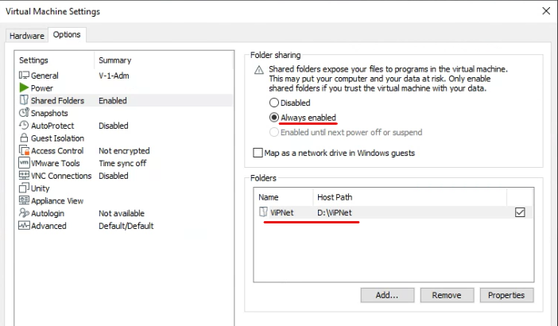

#### Часть 4. Настройка IP-адресов

По мере построения сети ViPNet, необходимо выставлять IP-адреса на сетевых интерфейсах, на Windows 10 это делается через свойства адаптера (можно нажать на **Win+R и ввести ncpa.cpl**). Как настраивать IP-адреса на интерфейсах координаторов мы рассмотрим отдельно.

>Win+R => ncpa.cpl


#### Часть 5. Отключение брандмауэра

Отключение брандмауэра производится через меню "**Брандмауэр Защитника Windows**" (введите в меню пуск), как показано на скриншоте


>Win+R => firewall.cpl

#### Часть 6. Настройка дисплея и спящего режима

Стоит отключить возможность выхода в спящий режим через определенное время, а также возможность отключения дисплея. Делается это с целью недопущения отключения ВМ, иначе можно потерять критические связи, например, между ЦУС клиент и ЦУС сервер при распределенной установке

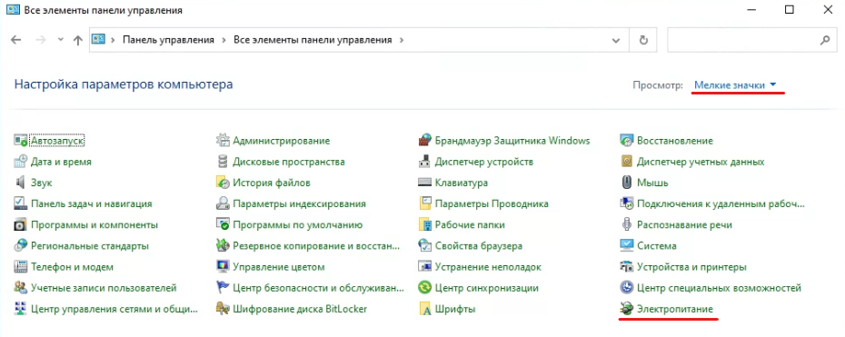


>Win+R => control panel

#### Часть 7. Активация режима частной сети

Переходим в "**Параметры**" => "**Сеть и Интернет**" => "**Состояние**" => **(Выбираем наш сетевой адаптер)** => "**Свойства**" => "**Сетевой профиль**" => "**Частные**"


Также этот параметр вы можете настроить во всплывающем окне в процессе развертывания стенда (после установки ViPNet Client). Уведомление должно появиться само:


---
### Задание 1. Развертывание ПК Administrator в качестве центра сертификации

Пункты задания:
1. Установить базу данных на ВМ V-1-Open (незащищенный узел);
2. Установить и настроить рабочее место администратора (ВМ V-1-Adm (ЦО)): Центр управления сетью (серверное приложение ЦУС), Удостоверяющий и ключевой центр (УКЦ); использовать ранее установленную БД;
3. Установить клиент ЦУС на ВМ V-1-DB.

>ВНИМАНИЕ: ЦУС клиент будет установлен на V-1-Adm

#### Часть 1. Установка БД на V-1-DB

Для установки БД необходимо создать отдельную директорию:


Далее выбираем в качестве пути для установки папку, которую мы создали:


Необходимо выбрать установку нового SQL-сервера:


Принимаем лицензионное соглашение:


Пункты, связанные с обновлениями, пропускаем:


Раздел с дополнениями оставляем без изменений:


В разделе конфигурации стоит указать имя **WINNCCSQL**, чтобы потом не указывать новое имя БД, а использовать значение по умолчанию (увидим далее в ЦУС):


Для сервиса **SQL Server Browser** устанавливаем параметр **Startup Type** в значение **Automatic**:


В разделе **Authentication Mode** выбираем **Mixed Mode** и указываем пароль:


>Пароль - 1234

Настраиваем самый главный параметр - **FILESTREAM** по примеру ниже:


Процесс установки:


Завершение установки:

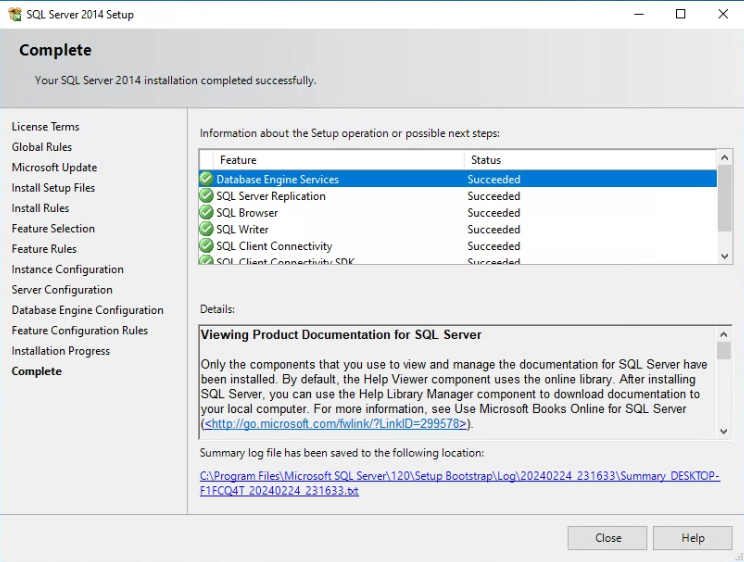

После установки находим **SQL Server 2014 Configuration Management** в меню **Пуск**:


Включаем **TCP/IP** и **Named Pipes** (последнее - опционально, в прошлой лабораторной работе и без этого было все нормально):


И перезапускаем **SQL Server**:


На этом установка SQL-сервера завершена

#### Часть 2. Установка серверного приложения ЦУС и УКЦ на V-1-Adm, настройка службы NccService

Теперь включаем вторую ВМ V-1-Adm и настраиваем ее, как описано в разделе "Подготовка" (далее подразумевается, что все машины на базе Windows 10 настраиваются аналогично). После этого находим **установщик серверной части ЦУС**:

>\\\\vmware-host\\Shared Folders\\ViPNet\\ViPNet Administrator.zip\\Soft\\Центр управления сетью\\Server Install\\Setup.exe

>Обязательно учитываем, что установщик может требовать зависимости, поэтому рекомендуется сначала извлекать полностью папку, а далее устанавливать. Например, для установки серверной части ЦУС, необходимо распаковать папку Server Install. Далее это упоминаться не будет

На данный момент у нас включено и настроено 2 ВМ - **V-1-Adm** и **V-1-DB**. Обязательно проверяем доступность ВМ друг для друга:


Запускаем установщик ЦУС (серверная часть) на V-1-Adm:


Выбираем язык установки:


Принимаем лицензионное соглашение:


Далее нам необходимо проверить связь с БД, как показано на скриншоте ниже:


Если проверка прошла успешно, переходим к установке:


На этом установка серверной части ЦУС на V-1-Adm закончена. Теперь нам необходимо сделать запуск службы **NccService** (для дальнейшей возможности подключения (и поддержания подключения) ЦУС сервер и ЦУС клиент между собой) все также на **V-1-Adm**


>Win + R => services.msc


>Данный этап крайне важен, иначе будут проблемы с ЦУС, которые решаются только сносом до исходного состояния ВМ

Далее необходимо **установить УКЦ на V-1-Adm**:

>\\\\vmware-host\\Shared Folders\\ViPNet\\ViPNet Administrator.zip\\Soft\\Удостоверяющий и ключевой центр\\Setup.exe


Принимаем лицензионное соглашение:


Запускаем УКЦ. Нам необходимо настроить новую БД:


Процесс инициализации (следуйте указаниям в сообщении):


Подключаемся к БД:


Имя и пароль пользователя **не меняем**:


И тут мы получаем ошибку:

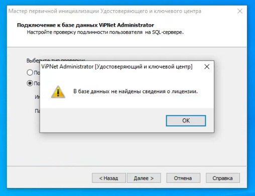

Происходит это ввиду того, что мы **не активировали ЦУС через клиентскую часть с помощью лицензии** для сети. **Перейдите к части 3**, установите клиентскую часть ЦУС и установите лицензию **и продолжите установку УКЦ**

Продолжаем (**после проделанных в части 3 работ**):


Ошибки возникнуть после выполнения части 3 не должно и мы можем продолжить настройку УКЦ:


Сведения о владельце сертификата на данный момент не заполняем (позже мы будем устанавливать новый сертификат):


В параметрах ключа ЭП значения также оставляем по умолчанию:


Место хранения в "**В файле**":


Срок действия сертификата, сведения о точках распространения, программные средства также не меняем:


>Аккредитованный режим настроим отдельно, это отдельная задача, рассматриваемая далее в гайде

Сделаем время до перехода в автоматический режим максимальное - 30 минут


Обязательно выбираем "**Собственный пароль**":


Путь для хранения:

>C:\\ProgramData\\InfoTeCS\\ViPNet Administrator\\KC\\Export\\Autentification Users

Устанавливаем пароль администратора сети ViPNet - **xxXX2244**


Завершаем первичную инициализацию:


УКЦ установлен:


#### Часть 3. Установка клиентского приложения ЦУС на V-1-Adm

Расположение установщика **клиентской части ЦУС**:

>\\\\vmware-host\\Shared Folders\\ViPNet\\ViPNet Administrator.zip\\Soft\\Центр управления сетью\\Client Install\\Setup.exe

Устанавливаем аналогично предыдущим пунктам задания, рассмотренных ранее:


Включаем ЦУС (клиент), первичный логин/пароль - **Administrator:Administrator**


Меняем пароль на - **xxXX2244**


Устанавливаем лицензию для сети:

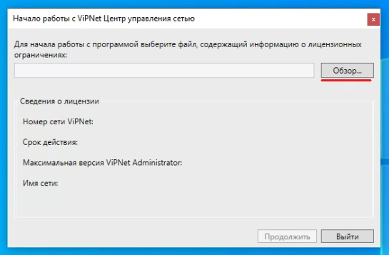


После применения лицензии откроется сам ЦУС:


На этом установка БД, ЦУС (клиентская и серверная части) и УКЦ завершена

---
### Задание 2. Инициализация VPN Coordinator и установка ПО VPN Client

Пункты задания:
1. Установить ПО Client, рабочее место администратора (V-1-Adm);
2. Инициализировать Coordinator HW-VA (V-1-HW-VA).

---
### Задание 3. Инициализация VPN Coordinator и установка ПО VPN Client для организации сети филиала

Пункты задания:
1. Инициализировать Coordinator HW-VA (V-2-HW-VA);
2. Установить ПО Client, рабочее место пользователя (V-2-Cli).

---
#### Часть 1. Установка ViPNet Client

Установщик ПО ViPNet Client:

>\\\\vmware-host\\Shared Folders\\ViPNet\\Client 4.x.7z\\2. Client 4.5.1\\client_RUS_4.5.1.57252.exe

Принимаем лицензионное соглашение:


Ключевой момент - не перезапускаем ВМ после установки ViPNet Client

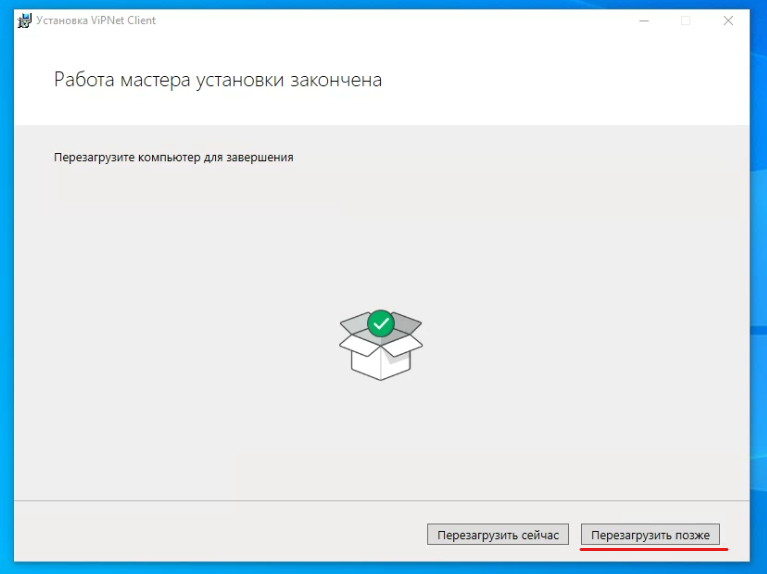

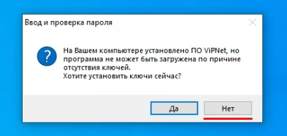

К инициализации координаторов вернемся позже в задании 5, т.к. у нас на данный момент нет DST-ключей.

---
### Задание 4. Развертывание удостоверяющего и ключевого центра в составе сети

В итоге выполнения задания должны быть развернуты и настроены следующие **сетевые узлы защищенной сети** (см. таблицу):

|         ВМ         |   Название сетевого узла    |                           ПО                           |       ОС       | Имя пользователя сетевого узла, уровень полномочий |
| :----------------: | :-------------------------: | :----------------------------------------------------: | :------------: | :------------------------------------------------: |
|    V-1-Adm (ЦО)    | Главный администратор (VM)  | Administrator (ЦУС серверное приложение + УКЦ), Client | Windows 10 Pro |                       Admin                        |
|   V-1-HW-VA (ЦО)   | Координатор Центр Офис (VM) |                   Coordinator HW-VA                    |     Linux      |                 CoordinatorOffice                  |
| V-2-HW-VA (Филиал) |   Координатор Филиал (VM)   |                   Coordinator HW-VA                    |     Linux      |                   CoordinatorSub                   |
|  V-2-Cli (Филиал)  | Пользователь_2 Филиал (VM)  |                         Client                         | Windows 10 Pro |                        User                        |

Связи пользователей представлены в таблице ниже:

|   Пользователи    | CoordinatorOffice | Admin | CoordinatorSub | User |
| :---------------: | :---------------: | :---: | :------------: | :--: |
| CoordinatorOffice |         x         |  \*   |       \*       |      |
|       Admin       |        \*         |   x   |                |  \*  |
|  CoordinatorSub   |        \*         |       |       x        |  \*  |
|       User        |                   |  \*   |       \*       |  x   |

---
### Задание 5. Создание структуры защищенной сети

**ЦУС**:
1. Необходимо создать в ЦУС структуру защищенной сети в соответствии с заданной схемой;
2. Выгрузить отчет в HTML;
3. Создать пользователей узлов, настроить полномочия пользователей и их связи в соответствии со схемой.

**УКЦ**:
4. Провести инициализацию УКЦ;
5. Сохранить контейнер ключей администратора в общей папке (создать подпапку Задача 1.5), поменять тип паролей для пользователей («собственный»). Задать пароли пользователей и сохранить в текстовый файл;
6. Сформировать дистрибутивы ключей для всех сетевых узлов (сохранить на жесткий диск);
7. Создать группы узлов для центрального офиса и филиала, настроить пароль администратора группы сетевых узлов для каждой из групп (проверить, что пароль работает). 

**Хосты**:
1. На всех узлах сети корректно настроить или проверить корректность настройки сетевых интерфейсов в соответствии со схемой, проверить доступность соседних узлов;
2. Разнести DST файлы по АРМ, провести первичную инициализацию узлов защищенной сети (координаторов и клиентов);
3. Проверить доступность узлов защищенной сети и сделать скриншоты работоспособности узлов;
4. Отправить письмо по Деловой почте и текстовое сообщение пользователю User c Admin (зафиксировать скриншотом);

**Итог**:
1. Необходимо сохранить файл HTML со структурой защищенной сети, выгруженный из ЦУС.

---
### Задание 6. Установка центра регистрации, сервиса публикации и сервиса информирования Certification Authority на соответствующие виртуальные машины

Пункты задания:
1. установить ПО Client - **V-1-OperCA**;
2. установить ПО Publication Service - **V-1-OperCA**;
3. установить ПО Registration Point - **V-1-OperCA**;
4. установить ПО CA Informing - **V-1-Adm**.

В итоге выполнения задания должны быть развернуты и настроены следующие **сетевые узлы защищенной сети** (см. таблицу):

|         ВМ         |   Название сетевого узла    |                                  ПО                                  |       ОС       | Имя пользователя сетевого узла, уровень полномочий |
| :----------------: | :-------------------------: | :------------------------------------------------------------------: | :------------: | :------------------------------------------------: |
|    V-1-Adm (ЦО)    | Главный администратор (VM)  | Administrator (ЦУС серверное приложение + УКЦ), Client, CA Informing | Windows 10 Pro |                       Admin                        |
|   V-1-HW-VA (ЦО)   | Координатор Центр Офис (VM) |                          Coordinator HW-VA                           |     Linux      |                 CoordinatorOffice                  |
|  V-1-OperCA (ЦО)   |      Оператор УЦ (VM)       |           Client, Publication Service, Registration Point            | Windows 10 Pro |                       OperCA                       |
| V-2-HW-VA (Филиал) |   Координатор Филиал (VM)   |                          Coordinator HW-VA                           |     Linux      |                   CoordinatorSub                   |
|  V-2-Cli (Филиал)  | Пользователь_2 Филиал (VM)  |                                Client                                | Windows 10 Pro |                        User                        |

Связи пользователей представлены в таблице ниже:

|   Пользователи    | CoordinatorOffice | Admin | OperCA | CoordinatorSub | User |
| :---------------: | :---------------: | :---: | :----: | :------------: | :--: |
| CoordinatorOffice |         x         |  \*   |   \*   |       \*       |      |
|       Admin       |        \*         |   x   |   \*   |                |  \*  |
|      OperCA       |        \*         |  \*   |   x    |       \*       |      |
|  CoordinatorSub   |        \*         |       |   \*   |       x        |  \*  |
|       User        |                   |  \*   |        |       \*       |  x   |

Ввиду комплексности заданий мы их объединим - задания 2 и 3 (по части координаторов), задания 4 - 6 структура первой сети. Пойдем поэтапно, но не совсем следуя последовательности задания. Ваш дальнейшие ориентир - заголовки со словом "Часть №." До следующего задания мы дойдем не скоро, будьте внимательны и четко следуйте инструкциям

---
#### Часть 1. Создание структуры защищенной сети

Для начала нам необходимо создать координаторы, клиентов и пользователей **средствами клиентского ПО ЦУС на V-1-DB**.

##### 1.1. Создание координаторов и их пользователей

Переходим в ЦУС (клиент) в раздел "**Координаторы**" и нажимаем на кнопку создания координатора (отмечена на скриншоте ниже):


Присваиваем имя координатору в соответствии с представленными выше таблицами:


>Обратите внимание на то, что необходимо убрать галочку с опции "Создать одноименного пользователя на новом узле автоматически"

Далее создаем пользователя для созданного координатора в соответствующем разделе "**Пользователи**" и также присваиваем ему имя в соответствии с представленными данными в таблицах задания:


Чтобы связать пользователя с созданным координатором, необходимо в разделе "Сетевой узел" при создании пользователя выбрать необходимого клиента или координатора. В нашем случае это координатор:


Далее создаем второй координатор подобным образом, что и первый:


Также создаем пользователя, как и ранее координаторы:


##### 1.2. Создание клиентов и их пользователей

В разделе "**Клиенты**" мы будем создавать остальные сетевые узлы, не являющиеся координаторами:


При создании обязательно учитываем, к какому из созданных ранее координаторов относится создаваемый клиент. Обязательно снова обращаем внимание на то, что **не нужно создавать одноименного пользователя!**: 


>Обязательно учитывайте, что **первый клиент - всегда администратор сети**, поэтому начинайте всегда создание клиентов именно с администратора сети, иначе можно столкнуться с проблемами

Как мы видим, возле иконки первого созданного клиента появился красный флажок, что свидетельствует о том, что данный клиент - администратор сети (в нашем случае сети №14443): 


Далее создаем пользователя для данного клиента - принцип точно такой же как и с координаторами (присваиваем нашему клиенту соответствующий сетевой узел):


На основе опыта создания предыдущих пользователей создаем остальные клиентов и пользователей. Ниже представлено создание клиента для V-2-Cli


> Аналогично необходимо создать остальных клиентов. Для вашего удобства и правильного ориентира ниже размещены 3 скриншота, отображающих все созданные сущности в сети, а также сводную таблицу для лучшего понимания ситуации

Координаторы:


Клиенты:


Пользователи координаторов и клиентов:


Сводная таблица (основана на таблице из задания):

|         ВМ         |   Название сетевого узла    | Имя пользователя сетевого узла, уровень полномочий |
| :----------------: | :-------------------------: | :------------------------------------------------: |
|    V-1-Adm (ЦО)    | Главный администратор (VM)  |                       Admin                        |
|   V-1-HW-VA (ЦО)   | Координатор Центр Офис (VM) |                 CoordinatorOffice                  |
|  V-1-OperCA (ЦО)   |      Оператор УЦ (VM)       |                       OperCA                       |
| V-2-HW-VA (Филиал) |   Координатор Филиал (VM)   |                   CoordinatorSub                   |
|  V-2-Cli (Филиал)  | Пользователь_2 Филиал (VM)  |                        User                        |

#### Часть 2. Создание связей между пользователями, присвоение ролей узлам сети, создание межсерверного канала, выгрузка отчета в формате HTML

##### 2.1. Присвоение ролей узлам сети, создание межсерверного канала

Присвоение ролей производится через свойства определенного узла. Возьмем первый координатор (V-1-HW-VA):


Для начала удаляем все существующие по умолчанию роли:


После удаления добавляем новую роль "**Coordinator HW-VA**":


Далее создается межсерверный канал между двумя координаторами первой сети (V-1-HW-VA и V-2-HW-VA):


После добавления межсерверного канала на одном координаторе, связь можно найти сразу на втором, без создания:


Не забываем добавить роль "Coordinator HW-VA" на второй координатор:


Далее нам необходимо создать связи между пользователями

##### 2.2. Связи между пользователями

|   Пользователи    | CoordinatorOffice | Admin | OperCA | CoordinatorSub | User |
| :---------------: | :---------------: | :---: | :----: | :------------: | :--: |
| CoordinatorOffice |         x         |  \*   |   \*   |       \*       |      |
|       Admin       |        \*         |   x   |   \*   |                |  \*  |
|      OperCA       |        \*         |  \*   |   x    |       \*       |      |
|  CoordinatorSub   |        \*         |       |   \*   |       x        |  \*  |
|       User        |                   |  \*   |        |       \*       |  x   |
Обозначения:

>\* = связь
>x = пересечение (один и тот же хост, связи нет)
>пустая клетка = отсутствие связи между сетевыми узлами

Связи между пользователями создаются все также через свойства пользователей в соответствующем разделе:


Добавляем связи в соответствии с таблицей. Ниже представлен пример связей для **CoordinatorOffice**:


##### 2.3. Установка IP-адресов через ЦУС для клиентов и координаторов

Теперь один из самых ключевых моментов - иногда бывает такое, что клиенты не видят координаторы, это из-за того, что клиенты не знают IP-адрес того или иного координатора (это далеко не единственная проблема, но основная - ее решение помогает в 90% случаев). Займемся установкой IP-адреса на координаторах через ЦУС, чтобы клиенты в дальнейшем получили информацию о том, куда им "смотреть", на какой координатор

Переходим в **свойства** координатора "**Координатор Центр Офис**" в раздел "**Адреса во внешних сетях**" и добавляем все IP-адреса, которые представлены в таблице:


Один из адресов (который относится к внутренней сети) **используем для доступа к MFTP**:


Собственно, итог конфигурирования адресов для "**Координатор Центр Офис**" через ЦУС:


А это итог для "**Координатор Филиал**":


Также установим адреса и для клиентов по примеру ниже:


>Повторяем операцию **для клиентов**: "Главный администратор", "Пользователь_2" и "Оператор УЦ"

##### 2.4. Выгрузка отчета в формате HTML

Выгрузка отчета в формате HTML является полноценным сводом информации о сети на том или ином этапе. Сделаем отчет. Переходим в ЦУС:


По умолчанию отчет сохраняется в формате XML, поэтому не забываем выбрать формат HTML при сохранении файла:


Собственно, как выглядит сам файл:


##### 2.5. Заканчиваем (забежим немного вперед)

Клиенту "**Оператор УЦ**" необходимо обязательно присвоить роль "**Registration Point**" - в последующем мы будем устанавливать данное ПО. Оно потребует лицензию, точнее, роль от клиента (его ключа). Поэтому сразу установим роль, перед тем, как формировать первичный дистрибутив ключей:


Сводная информация по аспектам лицензии (что занято, что свободно после наших работ):


#### Часть 3. Создание дистрибутива ключей для узлов сети средствами УКЦ, распространение DST-ключей, инициализация координаторов, проверка работоспособности сети

##### 3.1. Создание дистрибутива ключей

Для начала переходим в ЦУС и формируем справочники и ключи:

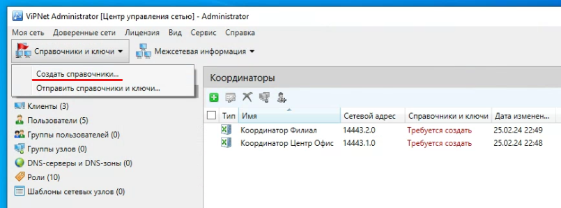

Отправляем их на весь список:


Теперь в ЦУС напротив клиентов/координаторов будет написано о том, что "**ожидаются ключи**":

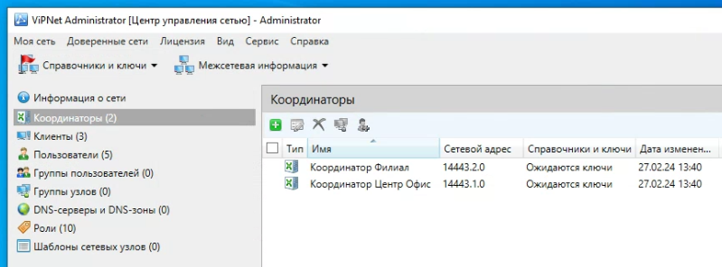

Переходим в УКЦ и проводим первичную инициализацию:


Видим, что в УКЦ в разделе "**Статус ключей**" указано "**Требуется создать дистрибутив ключей**":


Выделяем все сетевые узлы, нажимаем правой кнопкой мыши и выбираем "**Выдать новый дистрибутив ключей**":

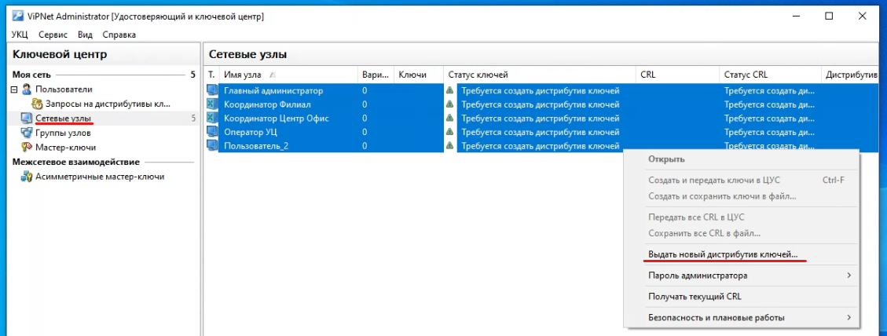

Далее все сведения оставляем без изменений (или ничего в поля не пишем):


Задаем пароль - **xxXX2244**


>Повторяем так для всех 5-ти сетевых узлов, устанавливая один и тот же пароль - **xxXX2244**

Когда мы завершим установку паролей в ходе создания ключей, откроется проводник, а вернее директория, где структурированно лежат наши сформированные ключи: 


Для удобства на рабочем столе ВМ V-1-Adm создадим ярлык, указывающий на директорию с ключами:


Также скопируем папку в общую папку между ВМ для удобства распространения ключей:


Теперь в УКЦ указан статус "**Переданы в дистрибутиве ключей**":


##### 3.2. Установка ключей для ViPNet Client, передача ключей в ЦУС

Для начала вспомним, что структурно мы добавили пользователя OperCA и сетевой узел для него через ЦУС, а также выдали ключ через УКЦ, но проблема в том, что мы не конфигурировали ВМ V-1-OperCA, поэтому запустим ее, установим IP-адрес, отключим брандмауэр, выключим возможность отключения монитора, а также установим ViPNet Client для OperCA, как делали это для других хостов.

После этого пришло время для установки ключей. Рассмотрим пример установки ключей на примере V-1-OperCA. Запускаем ViPNet Client и в разделе "**Настройка...**" нажимаем на "**Установить ключи**":


Указываем путь до ключа (ключи перепутать сложно, ведь они все распределены по папкам в соответствии с пользователями):


Итог установки ключей выглядит следующим образом:


Далее мы можем войти в саму программу при помощи пароля (xxXX2244), который мы создали для ключа на этапе формирования первичных ключей в УКЦ:


>Установку ключей повторяем и для других клиентов ViPNet - V-1-Adm и V-2-Cli

В разделе "**Защищенная сеть**" можно посмотреть клиентов ViPNet, с которыми мы можем контактировать (если они активны) - это и есть проявление связей с пользователями, которые мы настраивали ранее. В начале может быть такое, что нет активных клиентов, но если другие ключи вы установили, как я говорил чуть ранее, то связи должны появится в течение 1-2 минут:

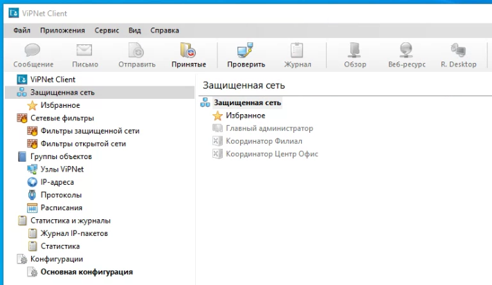

На данный момент у нас есть связь только с "**Оператор УЦ**", ввиду присвоенных связей через ЦУС:


##### 3.3. Инициализация координаторов

Сразу акцентирую внимание:

> Примечание: На координаторе в разделе "...continent or ocean..." необходимо выставлять параметр "UTC", вместо "Europe/Russia", в случае, если не работает основной метод, представленный ниже, я бы даже советовал использовать именно "UTC". Другой проверенный вариант - выставлять время вручную (это можно сделать после выставления часового пояса и региона)


Пришло время разобраться с самыми ключевыми узлами защищенных сетей ViPNet - Координаторами. Инициализация будет реализована через "**command line interface**":


>Этап 1 - Выбираем 1 (command line interface)


>Этап 2 - Выбираем дважды Yes (Y) (принятие пользовательского соглашения + начало конфигурации)
>Этап 3 - Выбираем 8 (Europe)
>Этап 4 - Выбираем 39 (Russia) 


>Этап 5 - Выбираем 2 (MSK+00 - Moscow area)
>Этап 6 - Выбираем 1 (Проверка настроек)

Останавливаемся на сообщении: "**Would you like to install keys...**". Далее необходимо создать ISO-образ на основе созданного в УКЦ ключа для координатора. Делать мы это можем разными способами, но ниже представлен вариант с **ImgBurn**:


>Будьте предельно внимательны при работе с данным ПО, потому что может получиться так, что вы неправильно запишите второй ключ в ISO-образ. Советую все-таки выйти из программы, когда первый ключ будет готов и повторить операцию для второго ключа, так вы не ошибетесь. Либо используйте другое ПО

После создания ISO-образа, необходимо его добавить (подключить) в координатор:


Не забываем указать путь до ISO-образа:


Переходим обратно в CLI координатора:


>Этап 7 - Выбираем "с" (Установка ключей через CD)


>Этап 8 - Вводим пароль, который указывали при создании ключа через УКЦ


>Этап 9 - Производим конфигурацию сетевых интерфейсов и сопутствующих параметров (на адресации остановимся подробнее далее)


>Этап 10 - Запуск координатора, завершение инициализации


На этом инициализация координатора "**Координатор Центр Офис**" завершена, можем наблюдать его активным в ViPNet Client, например, через **V-1-Adm**:


Второй координатор имеет схожий принцип настройки, но используются другие сетевые параметры. Начальные операции повторите аналогично настройке первого координатора, затем загрузите ключ и следуйте дальнейшим инструкциям ниже:


Как видим, второй координатор "**Координатор Филиал**" успешно определился и активен относительно **V-2-Cli**. Замечу, что в ходе вышеописанных (или других) операций, может появляться "**Предупреждение системы безопасности**", это вполне нормально:


Со временем (примерно через 1-2 минуты) "**Пользователь_2**" будет доступен и, например, для V-1-Adm, а это значит, что мы успешно настроили и соединили два координатора: 


Как мы помним, мы выдали дистрибутив ключей через УКЦ, но мы не передали сведения о ключах в ЦУС, поэтому напротив **координаторов/клиентов** в ЦУС установлен статус "**Ожидаются ключи**":

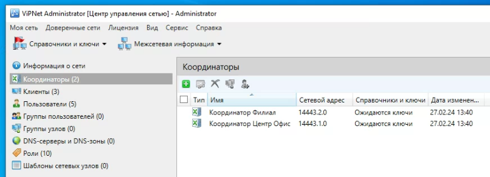

Через УКЦ вновь создаем и передаем ключи в ЦУС:


После этого в УКЦ напротив сетевых узлов появится статус "**Переданы в ЦУС**":


**Отправляем справочники и ключи**:


После отправки поменяется статус на "**Отправлены**", затем на "**Доставлены**" и наконец на "**Приняты**". Пример:


Еще пример:


##### 3.4. Создание групп узлов для центрального офиса и филиала, настройка паролей администратора для каждой из групп

Группы узлов создаются средствами ЦУС в соответствующем разделе:


Создаем две группы, задаем им имена:


Теперь распределим узлы по группам:


Узлы для группы "**Центральный Офис**":


Узлы для группы "**Филиал**":


Итоговое распределение таково:


Заходим в УКЦ и видим созданные группы (если они не появились, перезайдите в УКЦ): 


Для задания пароля необходимо перейти в свойства группы узлов, а конкретнее в раздел "**Пароль администратора**":


Присваиваем пароль и устанавливаем его срок действия:


Настроенный пароль (не знаю, почему он в открытом виде):


Итог работы с группами узлов:


Теперь надо вновь создать ключи и справочники и отправить их на узлы сети:


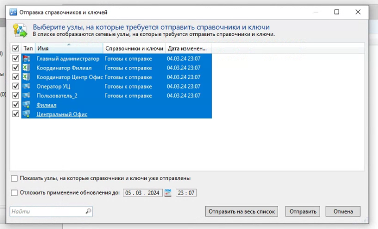

##### 3.5. Проверка работоспособности сети (отправка письма по деловой почте и мгновенного сообщения)

Мгновенные сообщения:


Деловая почта:


Переходим к установке ПО на V-1-OperCA. Установка всех компонентов происходит довольно просто, но есть и один нюанс. Давайте смотреть последовательно, но для начала учтем, что ViPNet Client уже установлен и функционирует на V-1-OperCA, это крайне важный момент, который всплывет в дальнейшем

#### Часть 4. Установка ViPNet CA Informing

Как всегда запускаем установщик (предварительно распаковав):

>\\\\vmware-host\\Shared Folders\\ViPNet\\ViPNet CA Informing.zip\\ViPNet CA Informing\\ca_informing-x86-r-msi-rus.msi


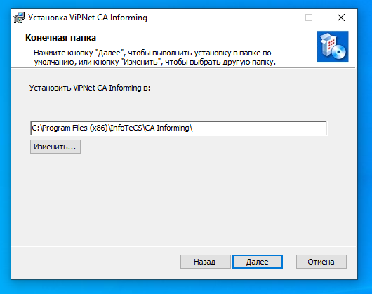


#### Часть 5. Установка ViPNet Publication Service

Установка также крайне проста:

>\\\\vmware-host\\Shared Folders\\ViPNet\\ViPNet Publication Service 4.6.6.zip\\ViPNet Publication Service 4.6.6\\Комплект пользователя\\Soft\\Setup.exe


#### Часть 6. Установка ViPNet Registration Point

Распаковываем и устанавливаем:

>\\\\vmware-host\\Shared Folders\\ViPNet\\ViPNet Registration Point 4.6.6.62901.zip\\ViPNet Registration Point 4.6.6.62901\\Комплект пользователя\\Soft\\Setup.exe


#### Часть 7. Активация ViPNet Registration Point

Вот тут как раз-таки и появляется важный момент, на который стоит обратить особое внимание - **процесс активации ViPNet Registration Point и ViPNet Client на V-1-OperCA происходит при помощи одного ключа**.

Как мы помним, когда мы устанавливали ViPNet Client, мы переходили в "**Настройка...**" => "**Установить ключи**" и выбирали ключ:


При запуске **ViPNet Registration Point** нужно делать немного по-другому. Заходим в "**Настройка...**" => "**Папка ключей сетевого узла**" и выбираем папку "**C:\\ProgramData\\InfoTeCS\\386B000D0\\**" (папка после ..\\InfoTeCS у вас может отличаться)


>Суть здесь в чём: почти в самом начале мы устанавливали для OperCA роль "Registration Point", при этом, когда мы через УКЦ выдавали дистрибутив ключей, нам выдался 1 ключ. Возникает вопрос - каким образом два разных ПО функционируют через 1 ключ? Все просто. ViPNet Client, как обычно, от ключа, который мы установили при разносе dst-файлов, а вот Registration Point просто ссылается на тот же самый ключ. Получается даже, что ViPNet Client и ViPNet Registration Point просто ссылаются на 1 ключ.

При активации может появиться следующее сообщение:


>Необходимо выбрать именно **ViPNet Client**, это крайне важно!

После активации перейдем в "**Сервис**" => "**Настройки**" => "**Транспорт**" и поставим на **автозапуск** транспортный модуль, а также **запустим его при помощи соответствующей кнопки**:


На этом пока что в данном разделе всё, сервис публикаций мы настроить позже отдельно

---
### Задание 7. Настройка работы удостоверяющего центра в аккредитованном режиме 

Необходимо перевести УКЦ в режим аккредитованного удостоверяющего центра, настроить параметры издания квалифицированных сертификатов, указав: 
1. сведения о средствах УЦ;
2. средство электронной подписи издателя;
3. средства удостоверяющего центра;
4. сертификат на средство электронной подписи издателя;
5. сертификат на средство удостоверяющего центра;
6. класс защищенности, которому соответствуют программные средства УЦ;
7. место хранения контейнеров ключа ЭП и ключа защиты УКЦ. 

После перевода УКЦ в аккредитованный режим необходимо выпустить: 
1. корневой квалифицированный сертификат;
2. квалифицированные электронные подписи для пользователей. 

При формировании сертификатов необходимо заполнить следующие поля: 
1. Имя: <Имя пользователя или узла> 
2. Электронная почта 
3. Город 
4. Область 
5. Организация 
6. Подразделение 
7. Почтовый индекс 

**Создать квалифицированные ключи ЭП и ключи проверки ЭП для пользователей сети**. Настроить схему обмена файлами между УКЦ посредством Сервиса Публикации (Publication Service). Реализовать автоматическую публикацию сертификатов. Посредством Центра Регистрации (Registration Point):
1. зарегистрировать пользователя; 
2. отправить запрос в УКЦ на выпуск сертификата, удовлетворить запрос; 
3. отправить запрос в УКЦ на аннулирование ранее выпущенного сертификата, удовлетворить запрос. 

Посредством Сервиса Информирования (CA Informing): настроить способ выдачи уведомлений и сформировать отчет о выданных за текущие сутки сертификатах, предварительно в настройках указав место хранения отчетов.

---
### Задание 8. Модификация структуры защищенной сети 

Перед началом выполнения сделать HTML выгрузку структуры сети и сделать скриншот ЦУС окна с пользователями. Модификация структуры сети: 
1. Добавить новый сетевой узел и пользователя за координатором (без фактического развертывания его на виртуальной машине). Добавить связь пользователя нового узла с пользователем. На указанных узлах проверить появление нового узла; 
2. Добавить пользователя на узле Филиал (V-2-Cli), связать его со всеми пользователями группы узлов центральный офис.

---
#### Часть 1. Перевод УКЦ в аккредитованный режим

Перед тем, как продолжить, мне хотелось бы сделать небольшую ремарку. Внимательно посмотрите на **Задание 8**, вы должны заметить, что я выделил жирным шрифтом 1 фразу, связанную с ключами ЭП. Это сделано не просто так. Давайте поочередно разбираться.

В одной из учебных пособий мне удалось найти информацию следующего характера:

>**Цитата**: Ключ электронной подписи и сертификат проверки ЭП содержаться в дистрибутиве ключей. Так же ЭП и сертификат проверки, можно сохранить в отдельный файл или записать на токен. Изданные сертификаты пользователя можно просмотреть в представлении УКЦ "Удостоверяющий центр" в разделе "Изданные сертификаты" => "Пользователи моей сети"

Получается, что, создав ранее дистрибутив ключей, мы уже частично выполнили пункт "**Создать квалифицированные ключи ЭП и ключи проверки ЭП для пользователей сети**". Но это всего лишь частично. Нам предстоит это повторить, упрощенно и с заполнением требующейся информации. Почему я решил сделать на этом акцент - для вашего понимания логики работы с ключами и сертификатами ЭП.

Переходим к УКЦ в аккредитованный режиме:


Устанавливаем галочку напротив соответствующей опции:


Есть два кнопки "Настроить...". Поочередно в них заходим и настраиваем работу в аккредитованном режиме:


>Программные средства:
>- Средство электронной подписи издателя: ViPNet CSP
>- Средство удостоверяющего центра: ПК ViPNet УЦ 4


>Сертификаты соответствия:
>- Сертификат на средство электронной подписи издателя: Demo.lab.crt
>- Сертификат на средство удостоверяющего центра: Demo.lab.p7b


>Класс защищенности:
>- КС2 и ниже

Таким образом мы настроили работу УКЦ в аккредитованном режиме.

#### Часть 2. Создание корневого сертификата

Есть такое мнение, что новый корневой сертификат создавать не надо, а надо при инициализации УКЦ в самом начале указывать все данные для администратора сети и всех остальных клиентов, но на мой взгляд необходимо всё-таки создать второй корневой сертификат и сделать его активным. Приступим:

Переходим в УКЦ в раздел "**Администрирование**" => "**Изданные сертификаты**" => "**Корневые сертификаты**" => (ПКМ) => "**Создать корневой сертификат...**":


Задаём все необходимые по заданию параметры (я задаю несколько больше для личных тестов, не обращайте внимания, если у меня есть и другие данные):


Вот, собственно, и момент создания ЭП:


Как видим, новый корневой сертификат успешно создан и стал текущим. После этого необходимо вновь "**Создать и передать ключи в ЦУС**" через УКЦ и "**Отправить справочники и ключи**" через ЦУС: 

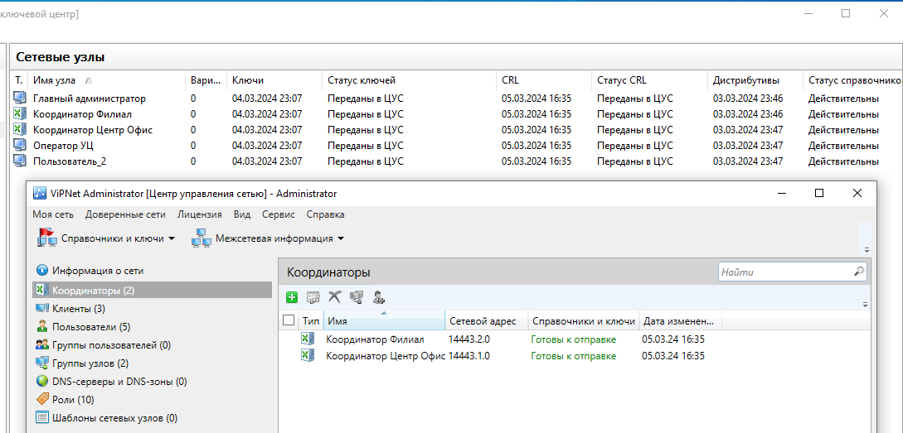


#### Часть 3. Создание ЭП для пользователей

Переходим в УКЦ именно в раздел "**Пользователи**", выделяем всех пользователей, нажимаем ПКМ, открываем меню "**Ключи пользователя**" => "**Создать и передать ключи в ЦУС**":


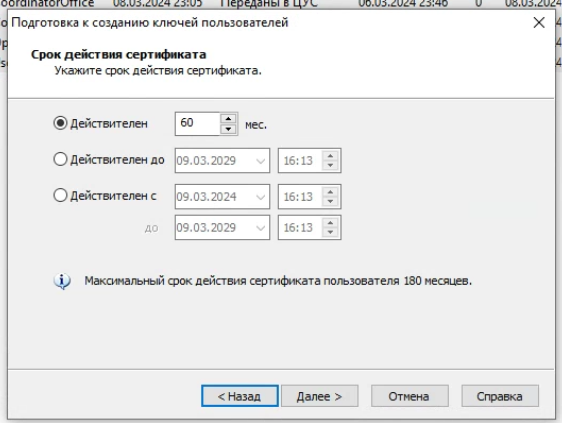


Не забываем заполнять поля необходимыми данными:


>Тут я представил скриншоты только для пользователя Admin, но подобным образом необходимо повторить операции для всех пользователей!

Мои данные для заполнения полей (в качестве примера):

| Пользователь      | Поле              | Данные                        |
| ----------------- | ----------------- | ----------------------------- |
| Admin             | Имя               | Admin                         |
|                   | Электронная почта | Admin@infotecs.ru             |
|                   | Город             | Москва                        |
|                   | Область           | Московская область            |
|                   | Организация       | МИРЭА Учебная сеть 1          |
|                   | Подразделение     | Центральный Офис              |
|                   | Почтовый индекс   | 127410                        |
| CoordinatorOffice | Имя               | CoordinatorOffice             |
|                   | Электронная почта | CoordinatorOffice@infotecs.ru |
|                   | Город             | Москва                        |
|                   | Область           | Московская область            |
|                   | Организация       | МИРЭА Учебная сеть 1          |
|                   | Подразделение     | Центральный Офис              |
|                   | Почтовый индекс   | 127410                        |
| CoordinatorSub    | Имя               | CoordinatorSub                |
|                   | Электронная почта | CoordinatorSub@infotecs.ru    |
|                   | Город             | Москва                        |
|                   | Область           | Московская область            |
|                   | Организация       | МИРЭА Учебная сеть 1          |
|                   | Подразделение     | Филиал                        |
|                   | Почтовый индекс   | 127410                        |
| OperCA            | Имя               | OperCA                        |
|                   | Электронная почта | OperCA@infotecs.ru            |
|                   | Город             | Москва                        |
|                   | Область           | Московская область            |
|                   | Организация       | МИРЭА Учебная сеть 1          |
|                   | Подразделение     | Центральный Офис              |
|                   | Почтовый индекс   | 127410                        |
| User              | Имя               | User                          |
|                   | Электронная почта | User@infotecs.ru              |
|                   | Город             | Москва                        |
|                   | Область           | Московская область            |
|                   | Организация       | МИРЭА Учебная сеть 1          |
|                   | Подразделение     | Филиал                        |
|                   | Почтовый индекс   | 127410                        |

В конце не забываем отправить справочники и ключи через ЦУС:


#### Часть 4. Настройка связи между УКЦ, Registration Point и Publication Service

Для того, чтобы связать **УКЦ**, который находится на **V-1-Adm** и **Publication Service**, **Registration Point**, которые находятся на другой ВМ - **V-1-OperCA**, необходимо **создать общий сервер для обмена данными**. Это будет **FTP-сервер**. Приступим к конфигурированию: 

##### 4.1. Установка компонента IIS на V-1-OperCA

Для начала нам необходимо добавить компонент "**Служба IIS**":


Обязательно добавляем компоненты FTP для IIS:


Компонент успешно добавлен, подготовим директории для FTP-сервера и общей папки для OperCA (также с целью связи)

##### 4.2. Подготовка папок на V-1-OperCA для конфигурации обмена файлами

Переходим на диск "**C:\\**" на V-1-OperCA и создаем папки:


>Создаваемые директории:
>- С:\\PublicServers\\
>- С:\\PublicServers\\In\\
>- С:\\PublicServers\\Out\\
>- С:\\PublicServers\\Unpublished\\
>- С:\\Certs\\
>- С:\\Certs\\cert\\

Папки для дальнейшей работы подготовили, создадим сам FTP-сервер средствами IIS 

##### 4.3. Настройка IIS

Переходим в "**Диспетчер служб IIS**"


Удаляем стандартный сайт (опционально):


Переходим в раздел "**сайты**" и нажимаем "**Добавить FTP-сайт...**":


Конфигурируем в точности, как на скриншотах ниже:


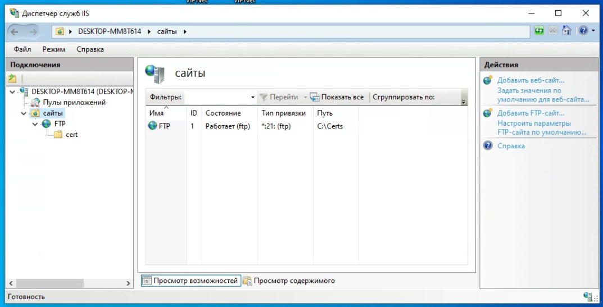

Сайт создан, и успешно запущен

##### 4.4. Создание общей папки

Теперь создадим общую папку на основе папки "**PublicServers**", которую мы впоследствии подключим в виде сетевого диска на V-1-Adm:


Общая папка успешно создана, переходим к подключению

##### 4.5. Подключение сетевой папки в качестве сетевого диска на V-1-Adm

Переходим на V-1-Adm и через "**Сеть**" находим общую папку, которую сделали ранее:


При переходе в эту папку может потребоваться ввести учетные данные от V-1-OperCA

>Логин: V-1-OperCA
>Пароль: xxXX2244


Теперь на V-1-Adm подключаем общую папку в качестве сетевого диска:


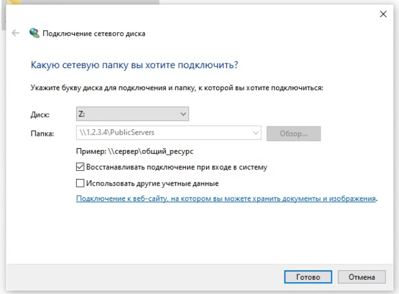

Собственно, результат:


##### 4.6. Настройка публикации данных в УКЦ, добавление точки распространения

Теперь переходим в **УКЦ** => "**Сервис**" => "**Настройка**" => "**Публикация данных**" и находим там стандартные пути для, непосредственно, публикации данных:


Их необходимо **СООТВЕТСТВЕННО** заменить на директории, которые находятся внутри сетевого диска, подключенного ранее. **Внимательно смотрите на скриншот выше и ниже**:


Далее переходим в **УКЦ** => "**Сервис**" => "**Настройка**" => "**Точки распространения**" => "**Серверы сертификатов и CRL**" и нажимаем "**Добавить**":


В качестве сертификата издателя выбираем созданный нами корневой сертификат:


Имя сервера может быть любым. Сетевой путь указываем в точности, как показано на скриншоте ниже:


>ftp://1.2.3.4/cert/

Тип точки распространения - **Сертификат издателя**. Результат добавления точки распространения:


Также перейдем в **УКЦ** => "**Сервис**" => "**Настройка**" => "**Автоматический режим**" => "**Действия**" и находим пункт "**Списки аннулированных сертификатов**" => "**Передавать все CRL в Центр управления сетью**":


Устанавливаем галочку на "**Передавать все CRL в Центр управления сетью**" каждые 24 часа:


Результат:


##### 4.7. Конфигурирование ViPNet Publication Service для связи с УКЦ

Запускаем программу, не регистрируя:


Переходим в раздел настройки и меняем директории для отправки и приема файлов из УКЦ:


>Соблюдайте последовательность! Сначала \\Out, потом \\In

Далее переходим в раздел "**Публикации**" и добавляем новуюпубликацию:


Откроется **мастер создания публикации**, где в самом начале мы выбираем "**Сертификаты издателей**":


Т.к. связь у нас предполагается через FTP-сервер, который мы создали ранее, то выбираем именно его:


Вводим IP-адрес V-1-OperCA (там у нас и установлен FTP-сервер), порт оставляем по умолчанию 21:


Вводим учетные данные:


>Логин: V-1-OperCA
>Пароль: xxXX2244

Абсолютный путь каталога - **/cert**, не перепутайте!


Название можно сделать любым:


Проверяем указанные параметры на наличие ошибок при помощи соответствующей кнопки:


Результат создания публикации:


##### 4.8. Проверка работоспособности созданной публикации

Конфигурирование мы провели, но теперь самое главное - проверка работоспособности. Переходим в **УКЦ** => "**Администрирование**" => "**Корневые сертификаты**" => (ПКМ по сертификату Admin) => "**Опубликовать**": 
 

Сразу получаем сообщение об окончании публикации.


Проверяем публикацию через **Publication Service** на V-1-OperCA:


Как видим, мы успешно опубликовали созданный нами ранее корневой сертификат. Если сообщение об успешной публикации появилось, то это отличные новости, мы можем двигаться дальше.

#### Часть 5. Регистрация пользователя средствами ViPNet Registration Point
##### 5.1. Подготовка ViPNet Registration Point для регистрации пользователя 

В **ViPNet Registration Point** переходим в "**Сервис**" => "**Настройка**" => "**Запросы на дистрибутивы ключей**" и устанавливаем **галочку** напротив "**Создавать пароль пользователя в мастере создания запросов на дистрибутив ключей**":


Также добавим связи согласно определенного списка (эти связи будут присвоены регистрируемому пользователю по умолчанию). Замечу, что данная настройка является опциональной, связи можно настроить и во время непосредственно регистрации пользователя:


Для примера добавим следующие связи:


Проверяем, чтобы пароль имел свойство "**Собственный**":


##### 5.2. Регистрация пользователя

>Примечание: запрос от Registration Point до УКЦ может доходить крайне долго, у некоторых это может занимать вплоть до 20 минут. Никто не мешает после 5-10 минут сделать перезагрузку V-1-Adm и V-1-OperCA и повторить запрос. Если до этого вы делали все также, как я, то запрос рано или поздно должен прийти.

Нажимаем на кнопку регистрации пользователя:


Откроется мастер создания пользователя, где мы выбираем "**Зарегистрировать пользователя самостоятельно**":


Указываем данные для пользователя, аналогично тому, как мы их прописывали ранее:


Регистрация пользователя завершена, сразу создадим **запрос на дистрибутив ключей**:


Откроется **мастер создания запроса на дистрибутив ключей**:


Выбираем "**Координатор Филиал**", за ним и будет закреплен новый пользователь:


Устанавливаем связи, при необходимости добавляем их через "**Добавить связь...**":


Раздел с ролями оставляем без изменений:


Указываем пароль:


>Пароль - xxXX2244

Завершение создания запроса на дистрибутив ключей:


Теперь мы можем непосредственно наблюдать наш запрос в Registration Point:


В скором времени (может не сразу) появится запрос на дистрибутив ключей уже в УКЦ, но перед этим клиент добавится в ЦУС (самостоятельно):


Если информация не доходит с первого раза, то можно попробовать "**Повторить отправку запроса в ЦУС**":


В УКЦ удовлетворяем запрос на дистрибутив ключей:


Как видим, в при создании дистрибутива ключей создается и сертификат для пользователя (если я сам не ошибаюсь, то это и есть сертификат ЭП):


Теперь **создаем и передаем ключи в ЦУС**:


Создаем справочники:


Вновь **создаем и передаем ключи в ЦУС**:

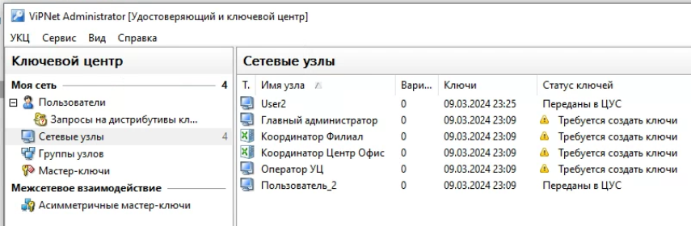

Отправляем справочники и ключи:


Теперь можно увидеть в Registration Point, что статус запроса на дистрибутив ключей имеет значение "**Удовлетворен**":


##### 5.3. Создание запроса на аннулирование сертификата

Так как с дистрибутивом ключей мы уже выпустили сертификат, то повторный запрос я на него делать не буду, но покажу, как сделать запрос на аннулирование сертификата. В Registration Point находим нашего пользователя в разделе "**Сертификаты**", нажимаем ПКМ и "**Аннулировать**":


Выбираем причину для аннулирования:


Ожидаем запрос в УКЦ:


Удовлетворяем запрос на аннулирование сертификата:


Теперь сертификат для "**User2**" помечен как аннулированный:


Статус нашего запроса в Registration Point "**Удовлетворен**":


#### Часть 6. Работа с CA Informing, формирование отчета о выданных сертификатах

##### 6.1. Конфигурирование ViPNet CA Informing

При первом открытии программы перед нами появится окно настройки. Сконфигурируйте все таким образом, как показано на скриншоте ниже:


>***Строка для подключения к базе данных***: Data Source=1.2.3.2\\Winnccsql;Initial Catalog=ViPNetAdministrator;User Id=KcaUser;Password=Number1

>***Сохранять в папку***: C:\\Users\\V-1-OperCA\\Documents\\CaInformingEmails

>***Папка для отчетов***: C:\\Users\\V-1-OperCA\\Documents\\CaInformingReports


Разделы "**Уведомления**" и "**OID**" оставляем без изменений

##### 6.2. Создание суточного отчета по выданным сертификатам пользователей

Открываем раздел "**Отчеты**" и нажимаем на "**Добавить**":


Меняем данные в разделе "**Общие**":


Раздел "**Вид**" оставляем без именений:


В разделе "**Фильтрация сертификатов**" ставим начальную дату для сертификатов (это должна быть ваша текущая дата, я делаю задание 09.03.2024, поэтому и сертификаты я выпускал в этот день, учитывайте свою дату). Конечную дату не ставим:


После сохранения шаблона отчета, нажимаем на кнопку "**Выполнить**" для формирования отчета по созданному шаблону:


Получаем информацию о том, что отчет сформирован:


>***Отчет***: C:\\Users\\V-1-OperCA\\Documents\\CaInformingReports\\CertificateReport_2024-03-10_183252704

---
### Задание 9. Межсетевое взаимодействие защищённых сетей (со связями «все со всеми»)

Пункты задания:

Развернуть на Net3-Admin (Сеть 3 межсеть) на ПК рабочее место Администратора партнёрской сети, создать структуру второй сети - рабочее место администратора (БД, ЦУС, УКЦ, ViPNet Client)
- 1 координатор (HW-VA или координатор Linux);
- 1 узел Admin;

Установить и настроить необходимое ПО. Настроить межсетевое взаимодействие между двумя защищёнными сетями, сделать скриншоты всех этапов установки межсетевого взаимодействия. Проверить взаимодействие узлов, отправив сообщение деловой почты.

---
#### Часть 1. Создание структуры второй сети (№14445)

Еще раз пробегусь по тому, что вам предстоит сделать самостоятельно на основе полученного опыта. От вас требуется:

1. Установленный SQL-сервер на V-3-Open;
2. Установленные ЦУС и УКЦ на V-3-Adm;
3. Активация Лицензии в ЦУС на V-3-Adm;
4. Созданный координатор "**CoordiantorExt", которому присвоена **роль** "**Coordinator HW-VA**" (+ удалены остальные роли) в ЦУС на V-3-Adm;
5. Созданный клиент "**Администратор**" (при его создании указывается **CoordiantorExt**) в ЦУС на V-3-Adm (**НЕ СОЗДАЕМ КЛИЕНТА ДЛЯ МАШИНЫ V-3-Open**), также установлены связи **ВСЕ-КО-ВСЕМ**;
6. Созданы справочники и ключи, при этом инициализирован УКЦ на V-3-Adm;
7. Выдан новый дистрибутив ключей для каждого пользователя/координатора через УКЦ на V-3-Adm (появились папки с папками, где лежат ключи);
8. Установлено ПО ViPNet Client на V-3-Adm (+активация);
9. Активирован координатор "**CoordiantorExt**" (тут **не нужно проверять соединение** между этим координатором и другими из первой и второй подсетей, просто завершаем настройку, но в качестве **основного шлюза** указываем IP-адрес "**Координатор Центр Офис**"). Когда вошли на координатор, можно проверить через ping доступность координатора **8.9.10.1**;
10. Повторно **создаем справочники** в ЦУС на **V-3-Adm**, затем через УКЦ **создаем и передаем ключи в ЦУС**, после этого уже в ЦУС **отправляем справочники и ключи**.

Процесс настройки координатора "**CoordinatorExt**":


Структура получившейся второй сети под номером **14445**:


#### Часть 2. Создание межсетевого взаимодействия

После того, как мы сконфигурировали две независимые сети (с номерами **14443** и **14445**) со своими отдельными администраторами, необходимо их соединить. Соединение производится посредством обмена информацией между администраторами разных сетей.

Переходим в ЦУС на **V-1-Adm** в раздел "**Доверенные сети**" и выбираем "**Установить взаимодействие...**":


**V-1-Adm** у нас будет выступать в роли инициатора межсетевого взаимодействия:


Указываем информацию противоположной сети. В качестве координатора, через который будет проходить туннель, указываем в качестве координатора "**Координатор Центр Офис**":


Далее необходимо добавить **все** сетевые узлы и **всех** пользователей сети 14443:


Создание и сохранение межсетевой информации:


После завершения операции переходим в УКЦ (**V-1-Adm**) и для начала **создаем и экспортируем мастер-ключ**, который необходим для установления межсетевого взаимодействия:


>Пароль: xxXX2244

Вот мы получили файл с межсетевой информацией и мастер-ключ:


Изначально эти файлы хранятся в следующих директориях:

>C:\ProgramData\InfoTeCS\ViPNet Administrator\NCC\Client\Export\14443-14445.lzh
>C:\ProgramData\Infotecs\ViPNet Administrator\KC\Export\Master keys\For net 14445

>Перенесите эти два компонента в общую папку - дальше эти файлы нужны будут на V-3-Adm

Переключаемся на **V-3-Adm** и переходим в ЦУС, чтобы загрузить межсетевую информацию от V-1-Adm:

>Я в общей папке с хостом выделил отдельную папку: \\\\vmware-host\\Shared Folders\\ViPNet\\For 14445\\


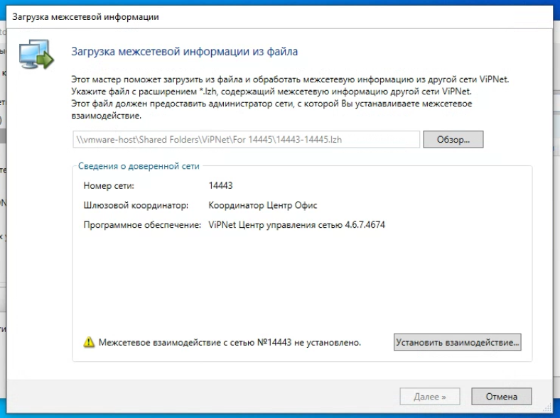

Здесь необходимо выбрать шлюзовый координатор противоположной сети с номером 14443. В нашем случае, это "**CoordinatorExt**":


Межсетевая информация загружена, далее **загружаем мастер-ключ** через УКЦ на V-3-Adm:


>Пароль: xxXX2244


Ключ загружен. Теперь надо решить вопрос с некоторыми предупреждениями, которые возникли после импорта данных. Сначала в разделе "Администрирование" обрабатываем сертификат:


Сертификат импортируем тот, который мы создали отдельно сами:


Теперь в УКЦ на V-3-Adm в разделе "**Ключевой центр**" создаем и передаем ключи в ЦУС:


Как видим, нам этого не удалось сделать по причине ошибки межсетевого мастер-ключа, поэтому исправляем проблему:


Нажимаем "**Отмена**" и идем решать проблему:

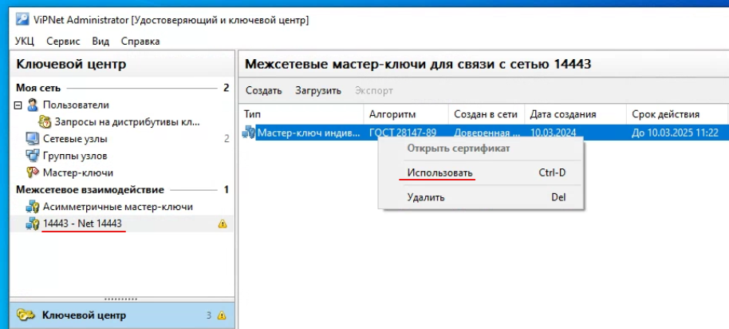

После исправления проблем, снова создаем и передаем ключи в ЦУС:


Далее создаем новые связи с пользователями (между пользователя из сети 14443 и 14445) через ЦУС на **V-3-Adm**:

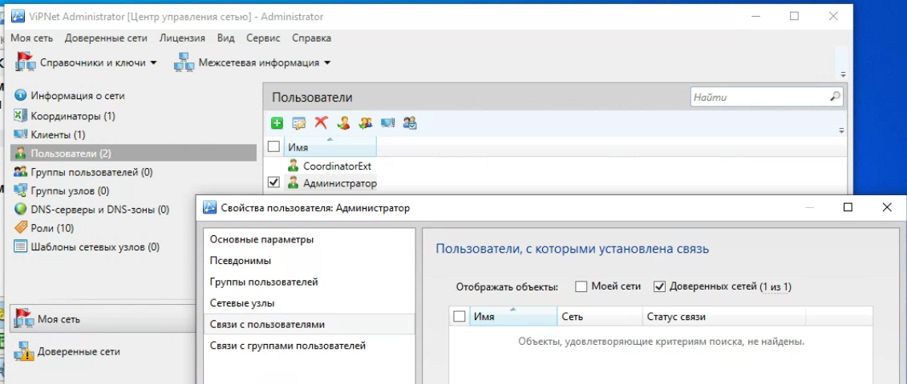

Не видим пользователей из доверенной сети, поэтому добавляем объекты (клиентов из доверенной сети):


Связи с "**Администратор**":


Связи с "**CoordinatorExt**":


Раз мы добавили связи в сети 14445, необходимо уведомить об этом сеть 14443, поэтому мы также создаем межсетевую информацию, но теперь уже через ЦУС **V-3-Adm**


Сохраняем межсетевую информацию в файл, чтобы затем перенести ее на V-1-Adm:


После сохранения создается файл **14445-14443.lzh**. Его переносим в общую папку. Далее переходим на V-1-Adm и загружаем межсетевую информацию:


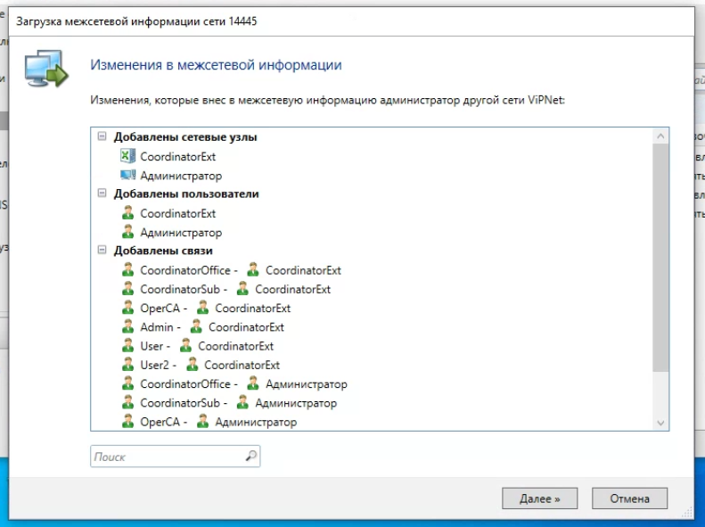


Теперь в ЦУС (**V-1-Adm**) вновь создаем сетевую информацию:


Решаем возникающие проблемы с сертификатом и мастер-ключом:

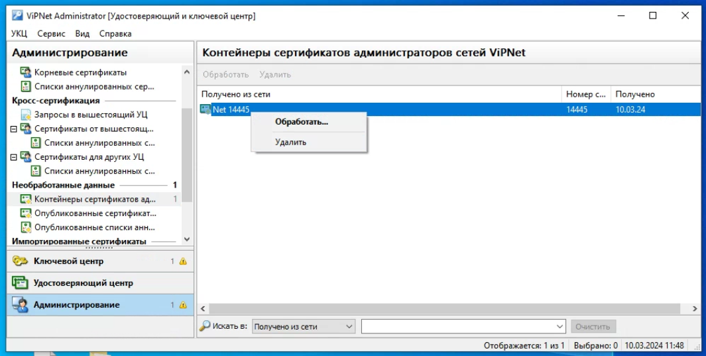


Далее создадим справочники и ключи ЦУС (**V-1-Adm**):


>***Тут нужно быть внимательным***: справочники и ключи надо создать и отправить на V-1-Adm и на V-3-Adm!

Обрабатываем межсетевую информацию:


>**Вот тут снова будьте внимательны**: проследите, чтобы координаторы обменялись межсетевой информацией!

---
### Задание 10. Туннелирование в рамках межсетевого взаимодействия 

Подключить незащищенную машину в сети 3. 
Настроить туннелирование таким образом, чтобы взаимодействие между открытыми узлами из разных сетей осуществлялось по шифрованному каналу. Проверить доступность незащищённых машин друг другу любым другим протоколом; проанализировать журналы IP-пакетов на координаторах. 
Скриншоты: 
- настройка максимального количества туннелей на координаторах;
- скриншоты прохождения ICMP пакетов (ping) и любого другого трафика с незащищенного узла; 
- скриншоты журнала IP-пакетов координатора с установленным фильтром «Туннелирование» для проверки прохождения ICMP-пакетов и любого другого трафика с помощью туннелирования.

---

Переходим к последнему шагу - созданию туннеля между двумя незащищенными узлами (V-1-DB и V-3-Open). Переходим на "**Координатор Центр Офис**" и увеличиваем максимальное количество туннелируемых соединений:


Устанавливаем **IP-адрес от V-1-DB**:

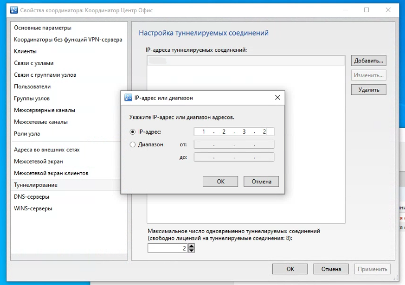

Не забываем про справочники и ключи:


На координаторе "**CoordinatorExt**" **через ЦУС на V-3-Adm** реализуем подобные действия, установив в качестве IP-адреса адрес **V-3-Open**:

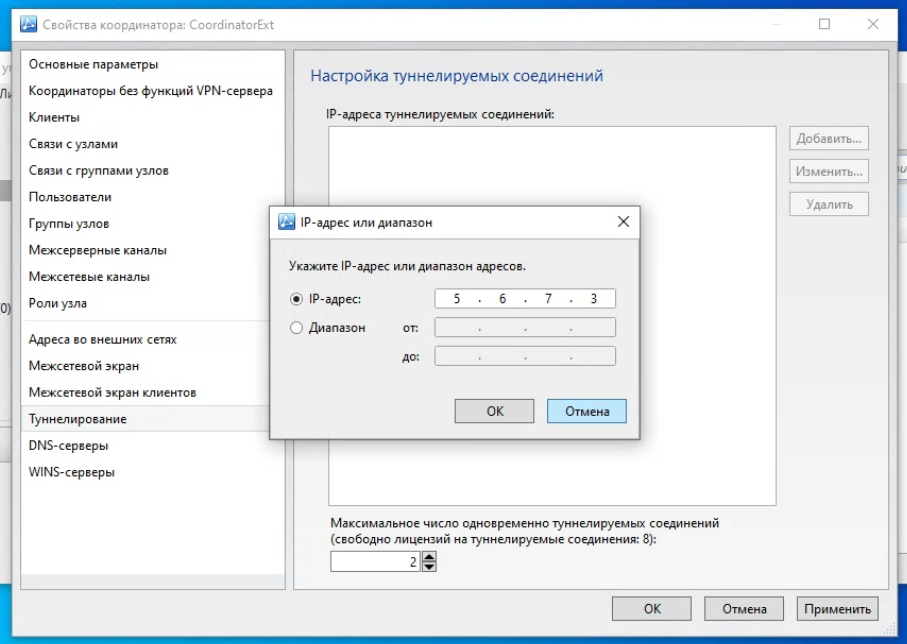

Теперь самое главное - создайте справочники и ключи в рамках отдельных сетей, а затем обменяйтесь межсетевой информацией, чтобы изменения вступили в силу:


Теперь в ViPNet Client на каждой из виртуальных машин можно наблюдать установленные связи между клиентами разных сетей ViPNet:

V-3-Adm:


V-1-Adm:


Проверяем туннелируемое соединение через ping, и в случае, если у вас V-1-DB видит V-3-Open, то вы сделали все верно! 


---

На этом все.

Made with :heartpulse: by "**o1d_bu7_go1d**" for KPK Students
